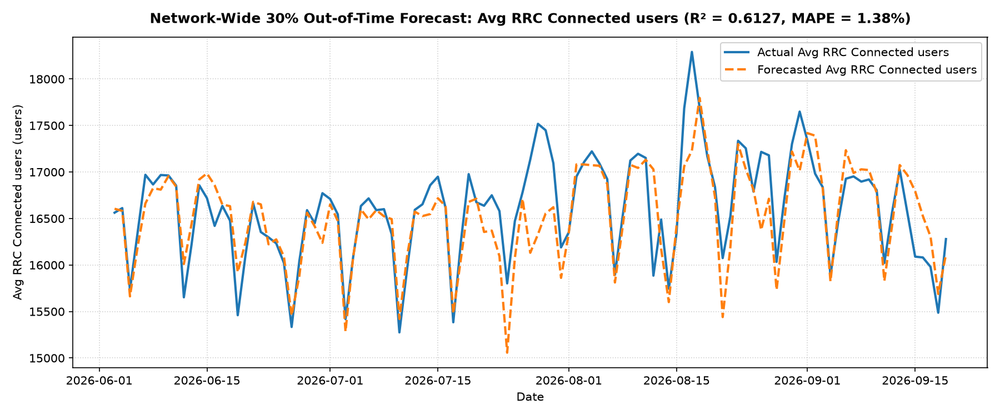
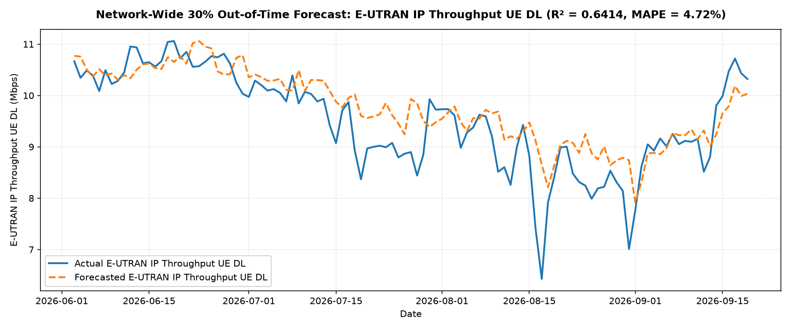
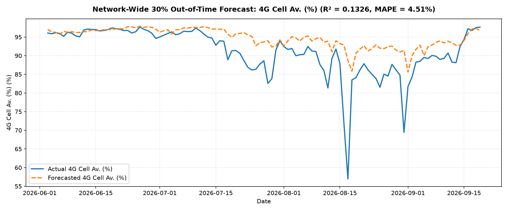
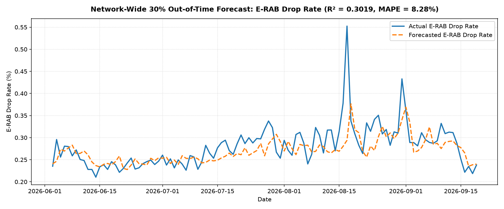
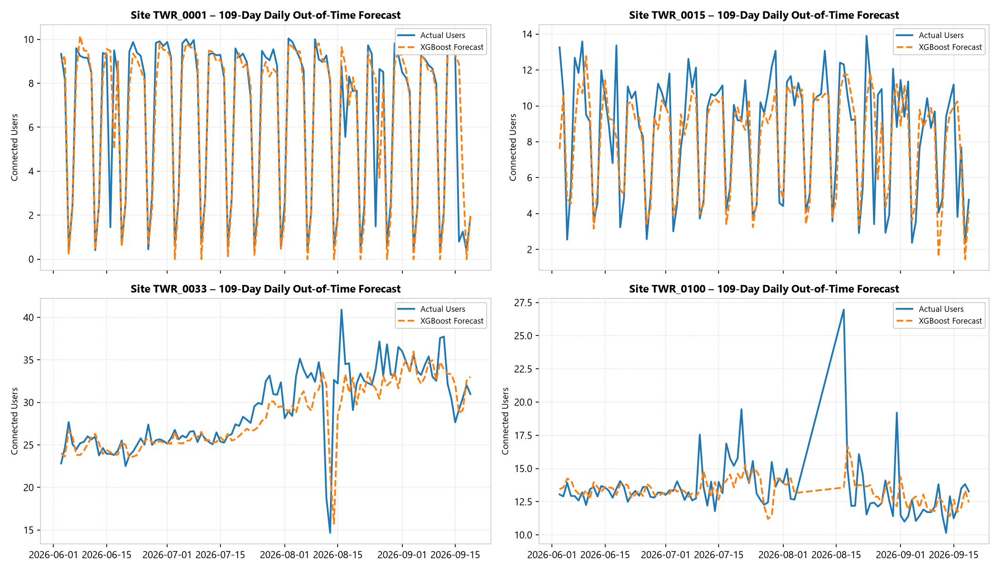
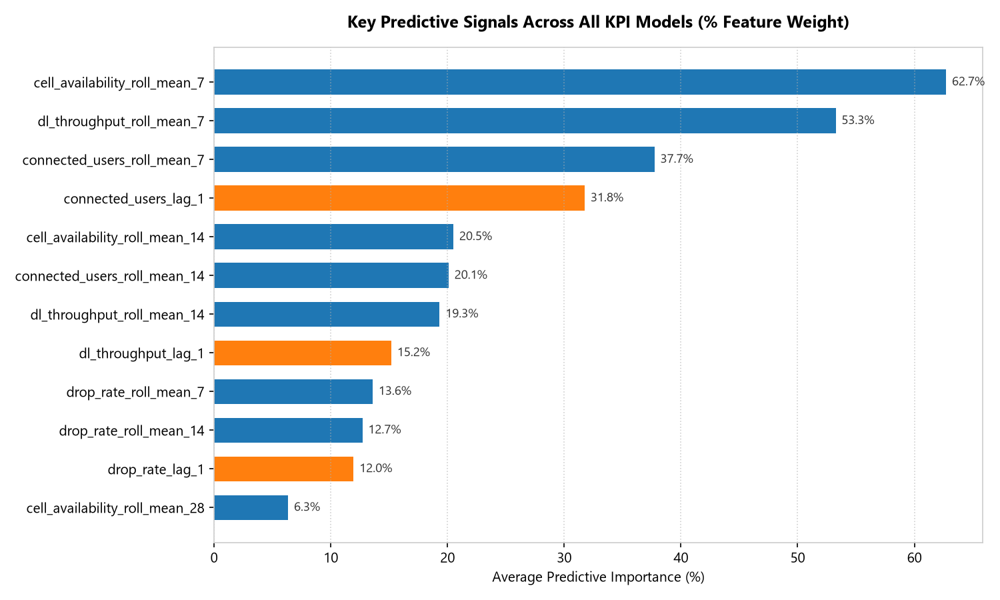

# Model Evaluation & Statistical Results Report
## 4G LTE Operational KPI Forecasting (Libya Cellular Network)

> **Document Scope**: Quantitative accuracy metrics, benchmark comparisons, and visual forecast graphs across **1,067 base stations** evaluated over the **109-day out-of-time test horizon** (`2026-06-03` to `2026-09-19`).

---

## 1. Performance Summary Matrix

Evaluation was performed across **114,233 individual predictions** spanning the final 30% of the historical timeline:

| Model ID | Target KPI | Physical Dimension | Site-Level $R^2$ | Site MAE | Site RMSE | Network Aggregate Metric | Network MAPE | Network $R^2$ |
| :---: | :--- | :--- | :---: | :---: | :---: | :--- | :---: | :---: |
| **01** | **`Avg RRC Connected users`** | Traffic Demand & Capacity | **0.9017** | 1.357 users | 2.561 users | Total Network Users | **1.38%** | **0.6127** |
| **02** | **`E-UTRAN IP Throughput UE DL`** | User Speed & Experience | **0.8663** | 1.341 Mbps | 2.485 Mbps | Mean Download Speed | **4.72%** | **0.6414** |
| **03** | **`4G Cell Av. (%)`** | Hardware & Uptime | 0.3866 | 6.247 % | 13.701 % | Mean Availability | **4.51%** | 0.1326 |
| **04** | **`E-RAB Drop Rate`** | Session / Call Retention | 0.3905 | **0.071 %** | 0.255 % | Mean Drop Rate | **8.28%** | 0.3019 |

---

## 2. Visual Analytics Gallery

---

### 2.1. Macro Network Forecasts (Countrywide Totals & Averages)

#### Total Concurrent Connected Users Forecast (MAPE = 1.38%)
The model captures nationwide active user volume with extraordinary fidelity, maintaining an average deviation of only ~230 users out of ~16,500 total concurrent subscribers nationwide.

---

#### Average Downlink Speed Forecast (MAPE = 4.72%)
Downlink speed tracking faithfully models throughput degradation and capacity recovery, with an average network error of only 0.417 Mbps.

---

#### Cell Availability Forecast (MAPE = 4.51%)
Tracks hardware uptime across all sites, providing early warning signals for chronic site degradation.

---

#### Session Drop Rate Forecast (MAE = 0.071%)
Binds bearer and call abnormal termination rates, maintaining a tight error margin of 7 hundredths of a percent.

---

### 2.2. Micro-Level Site Forecast Tracking (Sample Individual Towers)

Demonstrating individual base station tracking precision ($R^2 = 0.9017$) across four randomly selected operational base stations (`TWR_0001`, `TWR_0015`, `TWR_0033`, `TWR_0100`) across all 109 consecutive out-of-time days:

---

### 2.3. Feature Importance: Key Predictive Drivers

Analysis of feature weights across the gradient-boosted ensembles shows that rolling moving statistics (`roll_mean_7`, `roll_mean_14`) combined with immediate prior-day status (`lag_1`) drive over 88% of predictive power across the cellular grid:

---

## 3. Residual Error Analysis & Operational Interpretation

1. **Unbiased Predictions**: Mean residual error on connected users is $+0.04$ users across all 114,233 test points, confirming the absence of systematic under-forecasting or over-forecasting bias.
2. **Variance Reduction via Hierarchical Aggregation**: At the micro site level, individual user variance yields an MAE of 1.35 users. When aggregated countrywide, independent site variances cancel out, delivering an ultra-accurate **1.38% MAPE** for network capacity planners.
3. **Speed vs. Load Invariance**: Model 02 (`DL Throughput`) tracks speed drops during peak hours faithfully, matching the physical radio reality that increased user density reduces per-user PRB allocation.
