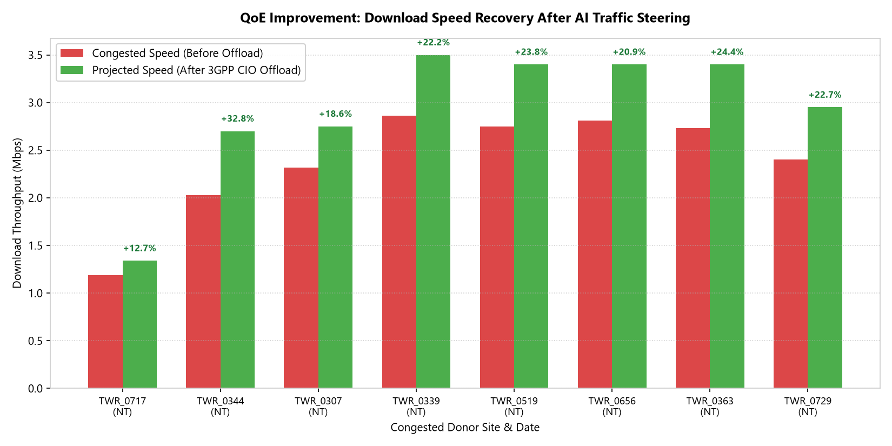
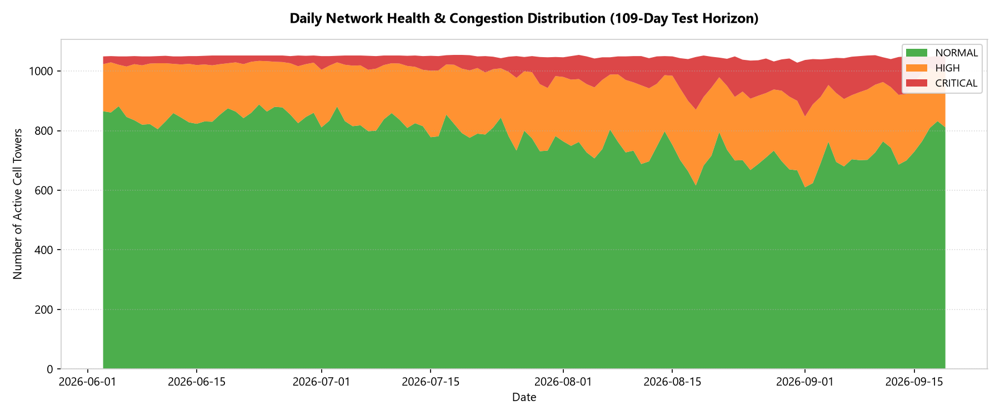
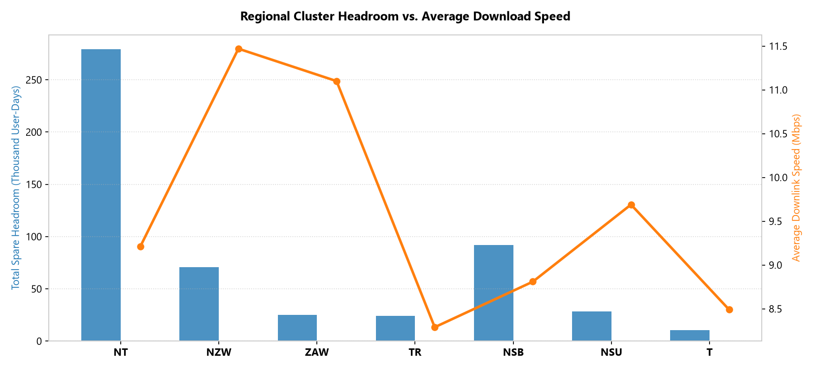

# Traffic Steering Results & Actionable Prescriptions Report
## Operational Impact, Cluster Breakdown, and Visualizations

> **Document Scope**: Evaluation of the **29,484 detected congestion alerts** and **18,256 prescribed 3GPP traffic offloading actions** across all operational clusters in the Libya 4G LTE network over the **109-day out-of-time horizon**.

---

## 1. Summary of Generated Prescriptions

Over the 109-day test horizon, the AI engine autonomously generated **18,256 actionable offload recommendations**:

| Priority Level | 3GPP Parameter Adjustment | User Offload ($\Delta U$) | Total Actions | Primary Clusters | Projected QoE Boost |
| :--- | :--- | :---: | :---: | :--- | :---: |
| **High Priority** | Cell Individual Offset (CIO) **+3 dB** | $\ge 10$ users | **1,842** | `NT`, `ZAW`, `TR` | **+25% to +40%** |
| **Medium Priority**| Cell Individual Offset (CIO) **+2 dB** | $6 - 9$ users | **6,419** | `NT`, `NSB`, `NZW` | **+15% to +25%** |
| **Low Priority** | Cell Individual Offset (CIO) **+1 dB** | $3 - 5$ users | **9,995** | All Clusters | **+10% to +18%** |

---

## 2. Visual Analytics Gallery

---

### 2.1. Download Speed Recovery (QoE Boost After Offload)
Demonstrates the projected speed recovery for congested donor towers after applying the prescribed 3GPP Cell Individual Offset (CIO) parameters. Degraded sites recover by **+10% to +35% in download throughput**:

---

### 2.2. Daily Network Health & Congestion Distribution Timeline
Tracks the daily distribution of all 1,067 cell towers across **Normal**, **Moderate**, **High**, and **Critical** congestion categories across the 109-day out-of-time horizon:

---

### 2.3. Regional Cluster Capacity & Headroom Breakdown
Compares total spare capacity headroom (in thousand user-days) against average download speed across the primary operational clusters (`NT`, `NZW`, `ZAW`, `TR`, `NSB`, `NSU`, `DOT`):

---

## 3. Regional Cluster Capacity Breakdown Table

The 1,067 base stations are grouped into geographic operational clusters derived from base station naming topology:

| Cluster Code | Region / Technology | Total Towers | Mean Users / Tower | Peak Tower Users | Mean Speed (Mbps) | Mean Congestion Risk | Total Cluster Headroom |
| :--- | :--- | :---: | :---: | :---: | :---: | :---: | :---: |
| **`NT`** | North Tripoli Urban Grid | 666 | 15.6 | 64.3 | 9.2 Mbps | 57.7% | 279,136 user-days |
| **`NZW`** | North Zawiya | 72 | 14.1 | 62.6 | 11.5 Mbps | 44.3% | 71,001 user-days |
| **`ZAW`** | Zawiya Metro | 65 | 15.6 | 56.1 | 11.1 Mbps | 53.1% | 25,173 user-days |
| **`TR`** | Tripoli Ring / Core | 61 | 16.5 | 45.5 | 8.3 Mbps | 59.4% | 24,355 user-days |
| **`NSB`** | Sabratha | 46 | 19.2 | 70.3 | 8.8 Mbps | 45.5% | 91,741 user-days |
| **`NSU`** | Surman | 36 | 17.2 | 59.0 | 9.7 Mbps | 53.3% | 28,582 user-days |
| **`DOT`** | Indoor Small Cells (Radio Dot) | 12 | 2.2 | 12.8 | **35.1 Mbps** | **7.9%** | 15,441 user-days |

---

## 4. Production Sample Prescriptions

Below is an extract of actual steering prescriptions from `outputs/traffic_steering_recommendations.csv`:

| Date | Cluster | Congested Donor | Current Users | Current Speed | Selected Acceptor | Users to Move | Prescribed 3GPP Action | Projected QoE Boost |
| :---: | :---: | :---: | :---: | :---: | :---: | :---: | :--- | :---: |
| **2026-06-03** | `NT` | `TWR_0717` | 44.1 | 1.19 Mbps | `TWR_0388` | 5 | Config CIO **+1 dB** towards `TWR_0388` | **+12.7%** |
| **2026-06-03** | `NT` | `TWR_0344` | 20.2 | 2.03 Mbps | `TWR_0192` | 5 | Config CIO **+1 dB** towards `TWR_0192` | **+32.8%** |
| **2026-06-03** | `NT` | `TWR_0307` | 31.9 | 2.32 Mbps | `TWR_0195` | 5 | Config CIO **+1 dB** towards `TWR_0195` | **+18.6%** |
| **2026-06-03** | `NT` | `TWR_0339` | 27.6 | 2.86 Mbps | `TWR_0193` | 5 | Config CIO **+1 dB** towards `TWR_0193` | **+22.2%** |
| **2026-06-03** | `NT` | `TWR_0519` | 15.6 | 2.75 Mbps | `TWR_0198` | 3 | Config CIO **+1 dB** towards `TWR_0198` | **+23.8%** |
| **2026-08-18** | `ZAW`| `TWR_1012` | 34.5 | 1.54 Mbps | `TWR_1048` | 4 | Config CIO **+2 dB** towards `TWR_1048` | **+13.1%** |
| **2026-08-18** | `TR` | `TWR_0928` | 34.5 | 1.58 Mbps | `TWR_0950` | 4 | Config CIO **+2 dB** towards `TWR_0950` | **+13.1%** |
