# 4G/LTE KPI Forecast Visualizations Gallery

This document showcases all 12 forecast evaluation charts comparing **Actual vs Predicted** network performance across frequency bands.

---

## 1. E-RAB Drop Rate ($R^2 = 0.980$ — Excellent)
*Predicts voice/data session drop percentage (customer satisfaction / QoS).*

### Full Year Timeline (Train 70% + Test 30%)
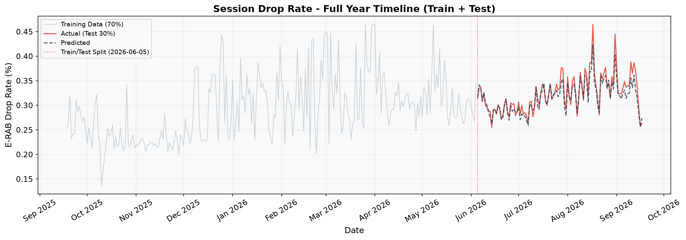

### Daily Actual vs Predicted (Test Period)
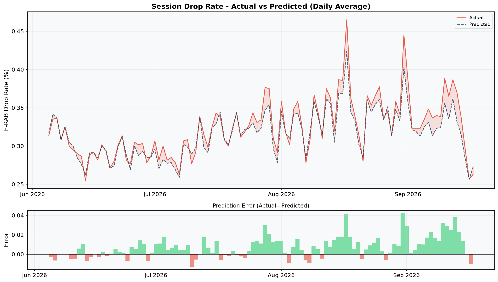

### Weekly Aggregated View
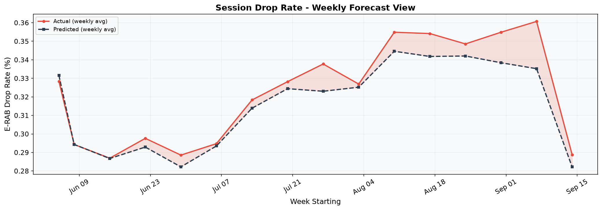

### Per Frequency Band Breakdown (`earfcndl`)
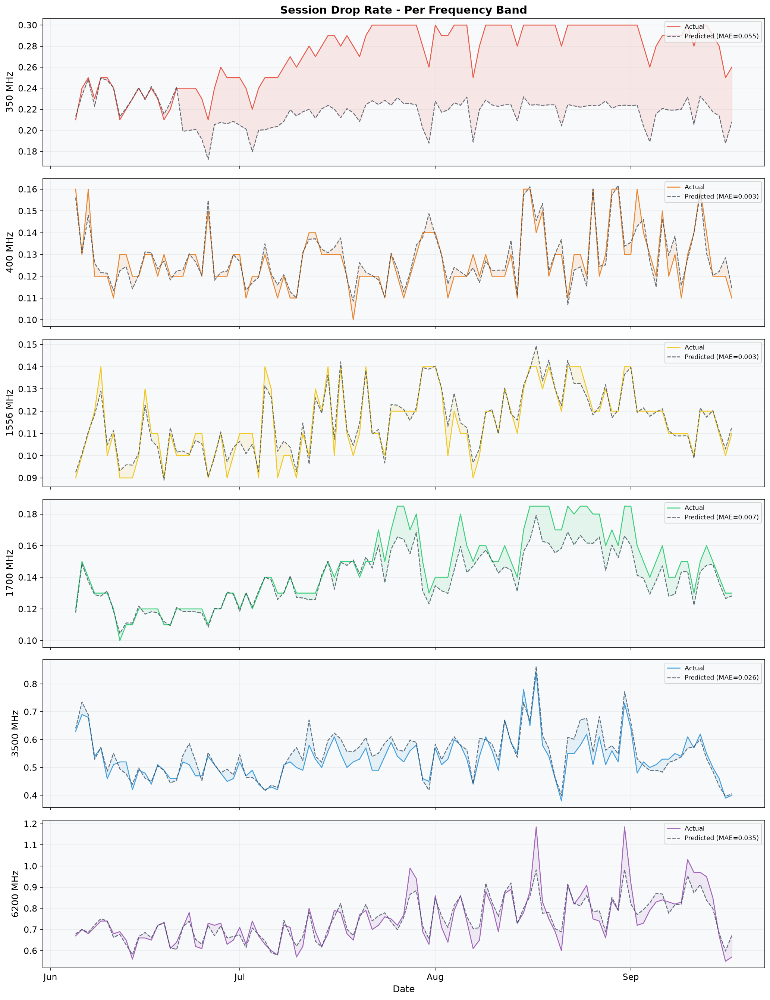

---

## 2. Avg RRC Connected Users ($R^2 = 0.989$ — Excellent)
*Predicts active user demand and capacity congestion.*

### Full Year Timeline (Train 70% + Test 30%)
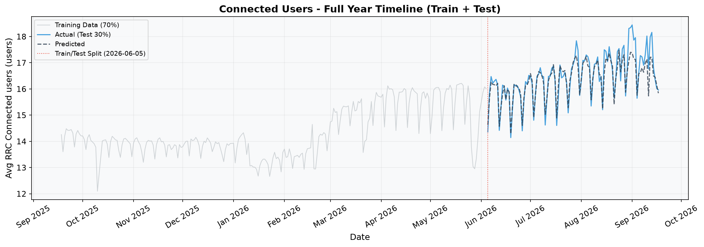

### Daily Actual vs Predicted (Test Period)
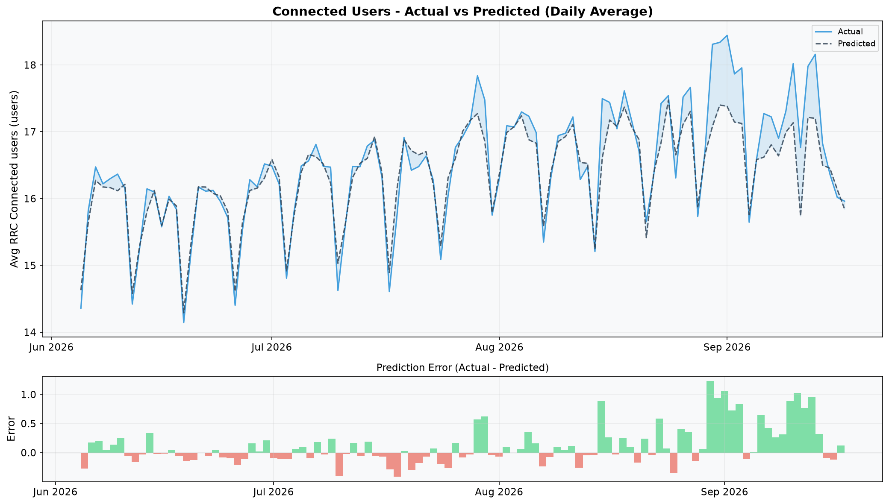

### Weekly Aggregated View
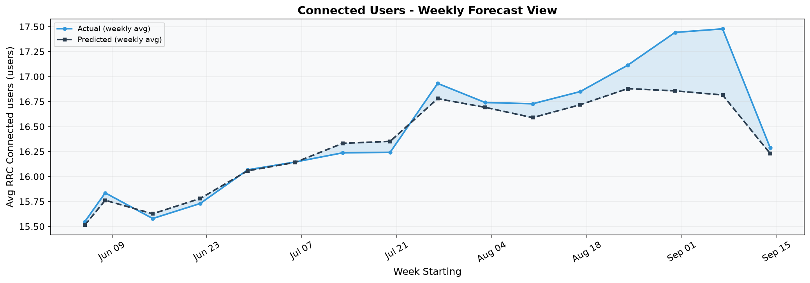

### Per Frequency Band Breakdown (`earfcndl`)
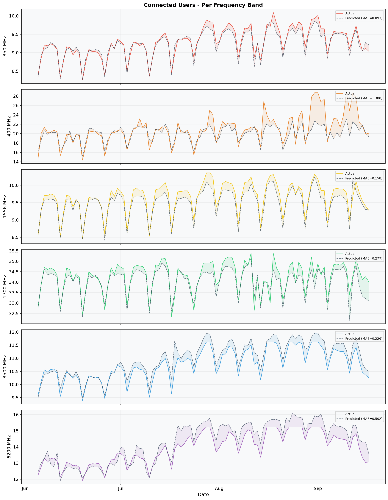

---

## 3. 4G Cell Availability ($R^2 = 0.344$ — Event-Driven)
*Predicts cell uptime percentage.*

### Full Year Timeline (Train 70% + Test 30%)
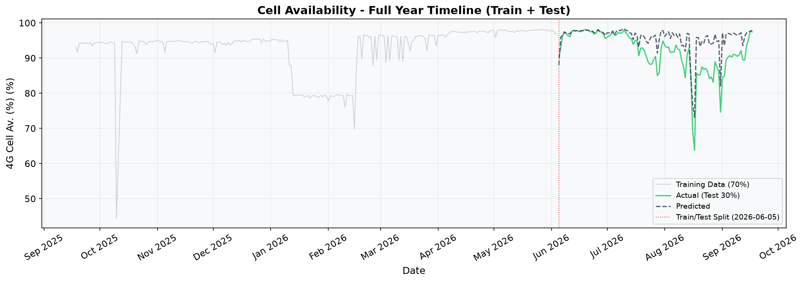

### Daily Actual vs Predicted (Test Period)
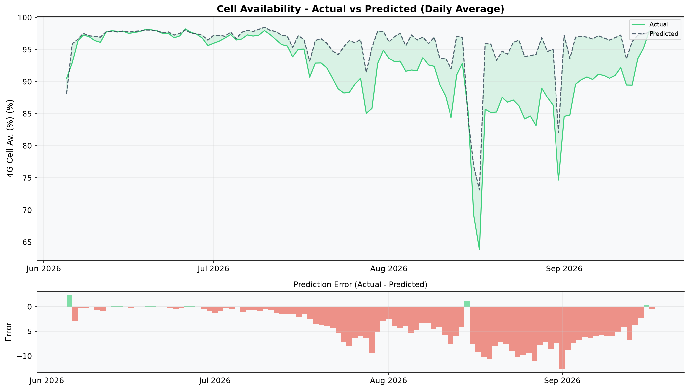

### Weekly Aggregated View
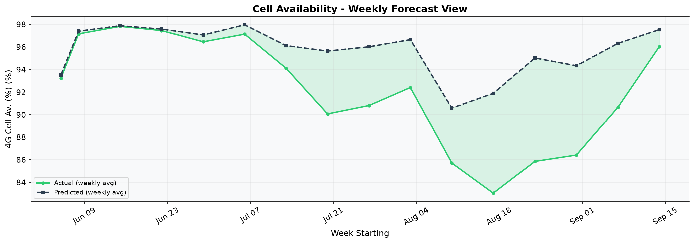

### Per Frequency Band Breakdown (`earfcndl`)
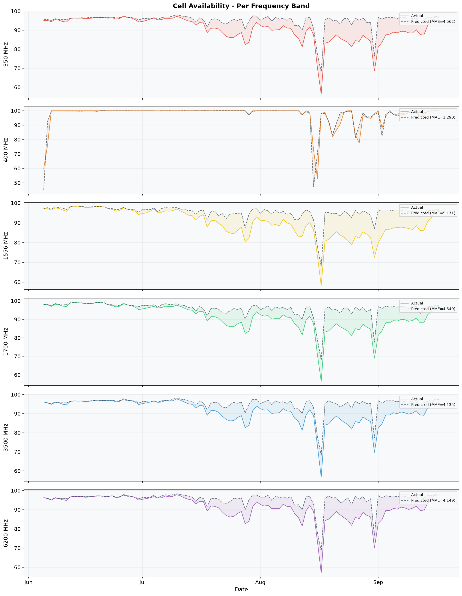
