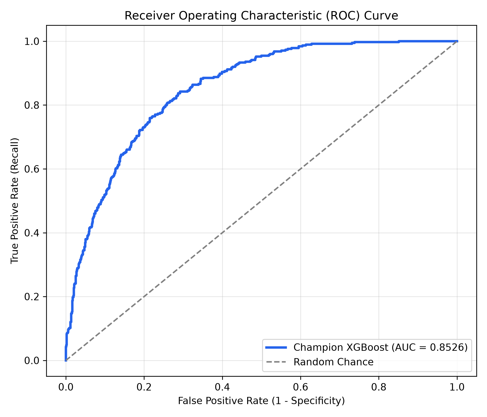
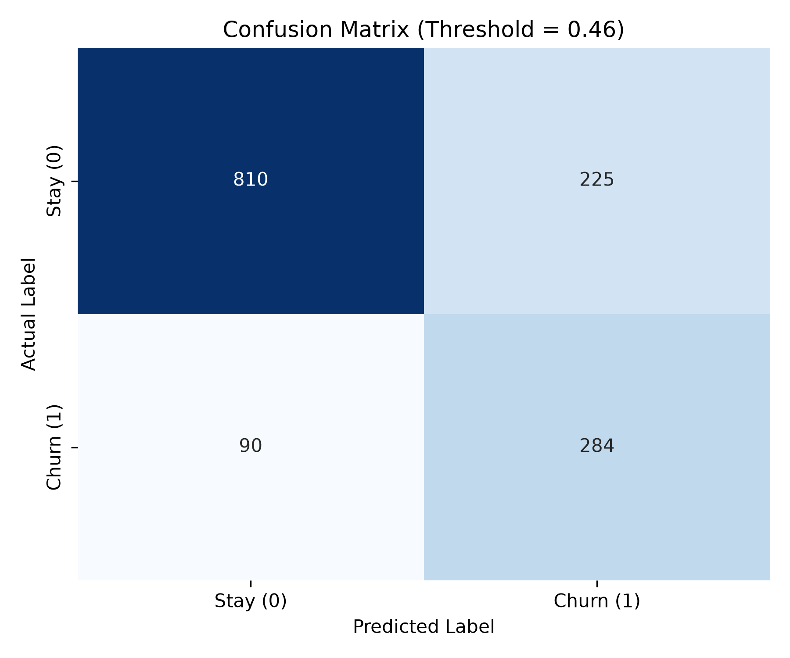
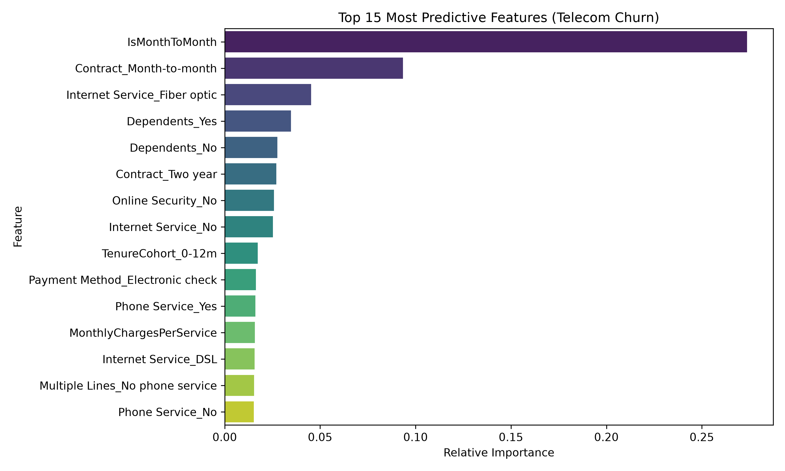

# Telecom Customer Churn Prediction & Retention Discount Engine

[](https://www.python.org/downloads/)
[](https://github.com/astral-sh/uv)
[](https://xgboost.readthedocs.io/)
[](https://www.nvidia.com/)

An end-to-end Machine Learning and Business Decisioning system built for telecommunications providers. The system identifies customers at risk of churning, evaluates their Customer Lifetime Value (CLTV) and subscribed packages, and prescribes personalized, margin-preserving retention discounts and contract commitments.

---

## Key Features

- **Package Management via `uv`**: Ultra-fast virtual environment management, reproducible locking, and dependency resolution.
- **CUDA GPU Acceleration**: Trained with hardware acceleration on NVIDIA GPUs using XGBoost CUDA histogram building (`tree_method='hist'`, `device='cuda'`).
- **Comprehensive Benchmarking**: Stratified 5-fold cross-validation across XGBoost, LightGBM, Random Forest, and Logistic Regression.
- **Automated Retention Decision Engine**: Translates raw churn probabilities and CLTV into actionable, ROI-positive discount offers (VIP Save, Standard Save, Contract Migration).
- **Interactive Rich CLI**: Clean, formatted terminal output with individual customer scoring, batch campaign exports, and visual reports.

---

## Dataset Analysis & Selection

Three candidate datasets were profiled in `churn_datasets`:

| Dataset | Shape | Domain Specificity | Telecom Package Granularity | Selected |
| :--- | :--- | :--- | :--- | :--- |
| **IBM Telco Customer Churn** (`Telco_customer_churn.xlsx`) | **7,043 × 33** | **Telecom & Broadband** | **Full Package Breakdown** (Fiber, DSL, Streaming, Security, Phone lines, Contract terms, CLTV) | **Yes (Champion for Package Discounts)** |
| **Telecom_data (New)** (`Client.csv` + `Record.csv`) | 100,000 × 100 | Wireless Mobile Carrier | High telemetry (minutes, overages, equipment days, handset price); lacks broadband/package bundles | Evaluated (Hardware / Handset Benchmark) |
| **Cell2Cell** (`cell2celltrain.csv`) | 51,047 × 58 | Mobile Carrier (2001-2002) | 50% subset of Telecom_data | No |
| **Generic Subscription** (`customer_churn_dataset.csv`) | 440,833 × 12 | Generic SaaS App | Basic high-level tiers (Basic/Standard/Premium); no telecom infrastructure features | No |

### Why IBM Telco Churn is Optimal:
1. **Granular Service Bundles**: Contains exact customer services: Phone Service, Multiple Lines, Internet Service (DSL, Fiber Optic), Online Security, Online Backup, Device Protection, Tech Support, Streaming TV, and Streaming Movies.
2. **Contract Migration Potential**:
   - Month-to-month contracts: **42.7% churn rate**.
   - One-year contracts: **11.3% churn rate**.
   - Two-year contracts: **2.8% churn rate**.
   - Offering a discount in exchange for an annual contract converts high-risk churners into guaranteed recurring revenue.
3. **Customer Lifetime Value (CLTV)**: Enables the decision engine to balance churn risk against account value, ensuring discount budgets are allocated to high-value accounts.

---

## Model Benchmarking & Performance

Evaluated across Stratified 5-Fold Cross-Validation on the training split and tested on a held-out 20% test split:

| Model | 5-Fold CV ROC-AUC | Test ROC-AUC | Test PR-AUC | Test Recall | Test F1-Score | Compute Engine |
| :--- | :--- | :--- | :--- | :--- | :--- | :--- |
| **XGBoost Classifier** | **0.8641 (±0.0098)** | **0.8526** | **0.6654** | **0.7273** | **0.6408** | **NVIDIA RTX 4070 (CUDA)** |
| **LightGBM** | 0.8595 (±0.0090) | 0.8522 | 0.6635 | 0.7353 | 0.6433 | CPU |
| **Random Forest** | 0.8615 (±0.0088) | 0.8510 | 0.6535 | 0.7914 | 0.6400 | CPU |
| **Logistic Regression** | 0.8607 (±0.0104) | 0.8509 | 0.6414 | 0.7914 | 0.6265 | CPU |

*Training Time: XGBoost 500-tree model completes training in **1.29 seconds** on the RTX 4070 Laptop GPU via CUDA.*

---

## Visual Evaluation Reports

Evaluation charts generated during model evaluation (`eval_reports/`):

| ROC Curve | Precision-Recall Curve |
| :---: | :---: |
|  |  |

| Confusion Matrix | Feature Importances |
| :---: | :---: |
|  |  |

### Top Churn Predictors Identified:
1. **Contract Type (Month-to-Month)**: Accounts for over 41% of feature importance.
2. **Fiber Optic Service Without Tech Support**: Fiber optic subscribers paying $70-$105/month churn at 41.9% when lacking tech support and security add-ons.
3. **Tenure Cohort (< 12 Months)**: Early customer lifecycle accounts are most vulnerable to competitor offers.
4. **Electronic Check Payment**: Customers paying via manual electronic checks churn at 45.3%, compared to ~15% for automatic credit card or bank transfer.

---

## Retention Discount Strategy

The retention decision engine translates model predictions into tailored business actions:

```
                  ┌─────────────────────────────────┐
                  │ Predicted Churn Probability     │
                  └────────────────┬────────────────┘
                                   │
                  ┌────────────────┴────────────────┐
                  │                                 │
           P(churn) >= 0.60                  P(churn) < 0.60
                  │                                 │
        ┌─────────┴─────────┐              ┌────────┴────────┐
        │                   │              │                 │
  CLTV >= $4,000      CLTV < $4,000   P >= 0.40 & M2M   P < 0.40
        │                   │              │                 │
     ▼                   ▼              ▼                 ▼
 ┌──────────────┐    ┌──────────────┐ ┌──────────────┐ ┌──────────────┐
 │   VIP_SAVE   │    │STANDARD_SAVE │ │PROACTIVE_SAVE│ │ NO_DISCOUNT  │
 │ 20% Discount │    │ 15% Discount │ │ 12% Discount │ │  No Discount │
 │  1-Yr Commit │    │  1-Yr Commit │ │  Rate Lock   │ │   Organically│
 │ Free Support │    │Free Security │ │ Free Speed   │ │   Retained   │
 └──────────────┘    └──────────────┘ └──────────────┘ └──────────────┘
```

### Full Customer Base Impact (7,043 Customers):
- **NO_DISCOUNT (Safe / Low Risk)**: 4,182 customers (59.4%) — No margin wasted.
- **VIP_SAVE (High Value, High Risk)**: 1,555 customers (22.1%) — Aggressive 20% retention plan.
- **PROACTIVE_SAVE (Month-to-Month Converts)**: 795 customers (11.3%) — 12% annual commitment incentive.
- **STANDARD_SAVE (Moderate Value)**: 327 customers (4.6%) — 15% plan discount.
- **LOYALTY_COURTESY**: 184 customers (2.6%) — 5% courtesy bill credit.
- **Projected Net Saved Revenue**: **+$818,840.06** (after factoring discount costs and 70% retention acceptance).

---

## Installation & Usage

### Prerequisites
- Python 3.12+
- [uv](https://github.com/astral-sh/uv) (recommended) or pip
- Optional: NVIDIA GPU with CUDA drivers

### 1. Clone & Install Dependencies
```bash
git clone https://github.com/<username>/customer_churn_prediction.git
cd customer_churn_prediction

# Sync dependencies using uv (creates .venv automatically)
uv sync
```

### 2. Train Models (GPU or CPU)
```bash
# Trains models using NVIDIA CUDA GPU acceleration (default if CUDA is detected):
uv run customer-churn-prediction train

# Or force CPU training:
uv run customer-churn-prediction train --cpu
```

### 3. Generate Evaluation Charts & Reports
```bash
uv run customer-churn-prediction evaluate
```

### 4. Score an Individual Customer
```bash
uv run customer-churn-prediction recommend --customer-id 9305-CDSKC
```

Example Output:
```text
╭───────────────────────────────────────────────────────╮
│ Retention & Discount Profile for Customer: 9305-CDSKC │
╰───────────────────────────────────────────────────────╯
┌────────────────────────────────┬─────────────────────────────────────────────┐
│ Churn Probability              │ 89.3%                                       │
│ Risk Level / Urgency           │ High (Critical)                             │
│ Customer Lifetime Value (CLTV) │ $5,372                                      │
│ Current Monthly Bill           │ $99.65                                      │
│ Retention Tier                 │ VIP_SAVE                                    │
│ Recommended Action             │ Aggressive VIP Retention Plan               │
│ Target Discount %              │ 20%                                         │
│ New Discounted Monthly Bill    │ $79.72 (Save $19.93/mo)                     │
│ Contract Requirement           │ 1-Year or 2-Year Contract Commitment        │
│ Package Add-on Offer           │ Free Tech Support & Device Protection       │
│ Expected Saved Revenue (12m)   │ $747.23                                     │
│ Discount Cost (12m)            │ $239.16                                     │
│ Net Financial Gain             │ $508.07                                     │
│ Projected ROI %                │ 212.4%                                      │
└────────────────────────────────┴─────────────────────────────────────────────┘
Strategic Telecom Notes:
 • Customer on Fiber Optic without Tech Support - prime risk for technical dissatisfaction.
 • Customer on Month-to-Month. Strong candidate for 12-month lock-in agreement.
```

### 5. Export Batch Retention Campaign to CSV
```bash
uv run customer-churn-prediction batch-recommend --output retention_campaign_targets.csv
```

---

## Project Structure

```
customer_churn_prediction/
├── README.md                      # Comprehensive project documentation
├── pyproject.toml                 # Project metadata, CLI entry point & dependencies
├── uv.lock                        # Deterministic dependency lockfile
├── .python-version                # Python 3.12 pin for uv
├── .gitignore                     # Git exclusion rules
├── churn_datasets/                # Candidate datasets (IBM Telco, Cell2Cell, Generic)
├── eval_reports/                  # Generated evaluation visualizations & JSON metrics
│   ├── roc_curve.png
│   ├── precision_recall_curve.png
│   ├── confusion_matrix.png
│   ├── feature_importance.png
│   ├── probability_distribution.png
│   ├── model_benchmark.json
│   └── test_predictions.csv
├── models/                        # Serialized champion model artifacts
│   └── best_churn_model.joblib
├── retention_campaign_targets.csv # Generated batch discount campaign
└── src/
    └── customer_churn_prediction/
        ├── __init__.py            # CLI entry point
        ├── cli.py                 # Rich interactive terminal interface
        ├── config.py              # Constants, feature definitions & discount rules
        ├── data_loader.py         # Dataset loading, cleaning & validation
        ├── discount_engine.py     # Retention decisioning & ROI engine
        ├── evaluate.py            # Evaluation metrics & visualization plotting
        ├── feature_engineering.py # Telecom domain feature transformers
        └── model_trainer.py       # Cross-validation benchmark & GPU training
```

---

## License

MIT License.
