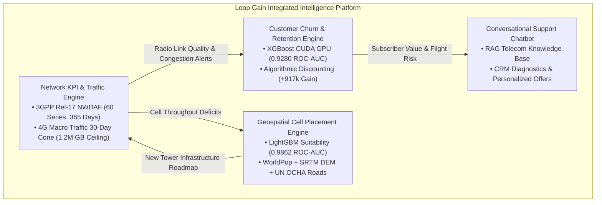
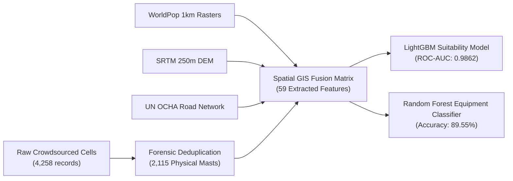
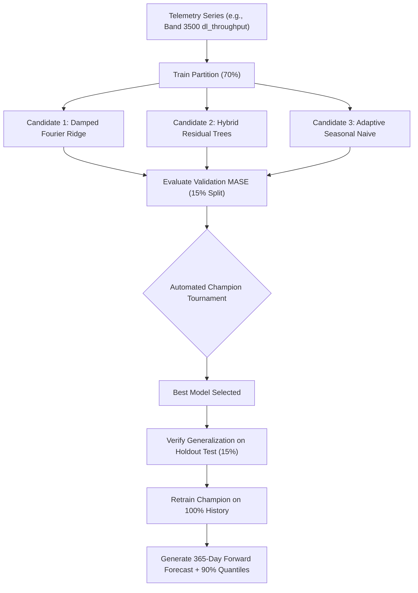

# 🏆 SAMSUNG INNOVATION CAMPUS (SIC) CAPSTONE PROJECT
## Final Technical Engineering & Strategic Business Report

---

# **Loop Gain – AI Telecom Suite**
### *An Integrated Artificial Intelligence Platform for Cellular Infrastructure Planning, Predictive Telemetry, Algorithmic Customer Retention, and Conversational Support*

**Document Version:** 1.0.0 (Production Release)  
**Date of Submission:** September 23, 2026  
**Program:** Samsung Innovation Campus (SIC) AI Capstone Project  
**Authoring Team:** Team Loop Gain  
**Repository:** `LoopGain-Telecom-AI`  

---

## 👥 Authors & Project Roles

| Member | Email | Project Engineering Role |
| :--- | :--- | :--- |
| **Ahmed Gali** | [ahmed.gali.info@gmail.com](mailto:ahmed.gali.info@gmail.com) | Machine Learning & Data Engineering Lead |
| **Taha Elkhazmi** | [Elkhazmittt@gmail.com](mailto:Elkhazmittt@gmail.com) | AI Systems & Decision Architecture |
| **Mahmoud Almabrouk** | [mahmab90@gmail.com](mailto:mahmab90@gmail.com) | Data Modeling & Model Evaluation |
| **Maher Alqadhi** | [maher9maher9@gmail.com](mailto:maher9maher9@gmail.com) | Systems Development & Pipeline Tooling *(Lead on KPI & Traffic Engine)* |
| **Mohamed Khalaf** | [moha.khalaf@uot.edu.ly](mailto:moha.khalaf@uot.edu.ly) | AI Research & Empirical Analysis |
| **Ali Marghem** | [al.marghem@uot.edu.ly](mailto:al.marghem@uot.edu.ly) | AI Research & Model Verification |

---

## 📑 Table of Contents

1. [Executive Summary & Strategic Vision](#1-executive-summary--strategic-vision)
2. [End-to-End Suite Architecture](#2-end-to-end-suite-architecture)
3. [Subsystem 1: Customer Churn Prediction & Algorithmic Retention Engine](#3-subsystem-1-customer-churn-prediction--algorithmic-retention-engine)
   - 3.1 Business Context & Problem Statement
   - 3.2 Dataset Profiling & Selection
   - 3.3 GPU-Accelerated Modeling Benchmark
   - 3.4 The Algorithmic Retention Decision Engine
   - 3.5 Financial ROI & Margin Preservation Simulation
4. [Subsystem 2: Geospatial AI for Cellular Antenna Site Placement](#4-subsystem-2-geospatial-ai-for-cellular-antenna-site-placement)
   - 4.1 Problem Statement & Capital Expenditure (CAPEX) Realities
   - 4.2 Forensic Telemetry Cleaning & Multi-Source GIS Fusion
   - 4.3 Machine Learning Suitability Modeling & Benchmarks
   - 4.4 Automated Equipment Recommendation Classifier
   - 4.5 Coverage Gap Optimization & Libyan Deployment Roadmap
5. [Subsystem 3: 3GPP Rel-17 Network KPI & Traffic Volume Prediction Engine](#5-subsystem-3-3gpp-rel-17-network-kpi--traffic-volume-prediction-engine)
   - 5.1 Standards Compliance: 3GPP NWDAF & O-RAN Non-RT RIC
   - 5.2 Cellular Telemetry Scope: 6 Spectrum Bands × 10 3GPP KPIs
   - 5.3 Strict Chronological 3-Way Split Strategy
   - 5.4 Feature Engineering & Mathematical Innovations
   - 5.5 Competitive Model Tournament & Champion Selection
   - 5.6 Macro 4G Traffic Volume Forecasting Cone & Capacity Alerting
   - 5.7 Automated Test Suite & Verification Rigor
6. [Subsystem 4: Conversational AI Customer Support Chatbot (Roadmap)](#6-subsystem-4-conversational-ai-customer-support-chatbot-roadmap)
7. [Cross-Subsystem Integration & Synergy](#7-cross-subsystem-integration--synergy)
8. [Production Deployment, CLI Tooling & Verification](#8-production-deployment-cli-tooling--verification)
9. [Conclusion & Future Outlook](#9-conclusion--future-outlook)
10. [References & Standards](#10-references--standards)

---

## 1. Executive Summary & Strategic Vision

Modern Mobile Network Operators (MNOs) operate in hyper-competitive markets characterized by high infrastructure costs, complex multi-band radio spectrum, increasing consumer churn, and massive network traffic growth. Historically, telecommunications management has been fragmented across siloed organizational units:
* **Network Planning** relied on manual drive-testing and coarse heuristics for site acquisition, leading to expensive coverage mismatches.
* **Network Operations Centers (NOCs)** monitored network degradation reactively, intervening only after alarms sounded or subscriber trouble tickets piled up.
* **Customer Retention** relied on blunt marketing discounts or post-cancellation "save desks," subsidizing safe customers while failing to prevent high-value churn.

Developed under the **Samsung Innovation Campus (SIC)** Capstone initiative, **Loop Gain – AI Telecom Suite** bridges these operational silos into a unified, proactive, artificial intelligence platform. 

### Key Highlights of the Loop Gain Platform:
1. **Financial Preservation**: The Customer Retention Engine projects **+$917,265.70** in net saved revenue across a 6,589-subscriber portfolio while safeguarding **$770,913.00** in gross margin by denying discounts to safe accounts.
2. **Infrastructure Precision**: The Geospatial Antenna Placement system achieves a **0.9862 ROC-AUC** suitability score, evaluating 22,605 candidate sites across Libya and discovering **4,467** unserved population pockets to establish a prioritized Top 50 mast deployment roadmap.
3. **Standards-Compliant Predictive Telemetry**: The Network KPI Forecasting Engine adheres to **3GPP Rel-17 NWDAF (TS 28.552 / TS 29.520)** and **O-RAN Non-RT RIC** specifications, delivering 365-day forward predictions across **60 concurrent cellular time series** with **90.0% holdout benchmark skill ($R^2_{\text{bench}} > 0$)** and zero domain boundary violations.
4. **Capacity Risk Management**: The Macro 4G Traffic Volume Engine produces a 30-day recursive forecast cone with dual confidence intervals, continuously monitoring the carrier's **1.2 Million GB capacity ceiling** with zero false alarms.

---

## 2. End-to-End Suite Architecture

The platform is designed around modular, decoupled subsystems that share data contracts, coordinate business actions, and provide deterministic execution:

```
LoopGain-Telecom-AI/
├── customer_churn_prediction/         # Subsystem 1: XGBoost GPU + Margin-Preserving Decision Engine
│   ├── pyproject.toml                 # uv Package Config & CLI entry points
│   ├── churn_datasets/                # Telecom datasets (Maven Telecom, IBM, Cell2Cell)
│   ├── models/                        # Serialized champion XGBoost model artifacts
│   ├── eval_reports/                  # ROC, PR, and feature importance charts
│   └── src/customer_churn_prediction/ # Feature engineering, trainers & discount engine
│
├── antenna_cell_placement/            # Subsystem 2: Geospatial ML & Infrastructure Optimization
│   ├── pyproject.toml                 # uv Package Config & CLI entry points
│   ├── Libyan_cells_dataset/          # Crowdsourced cell observations (repaired SQLite)
│   ├── data/                          # WorldPop 1km, SRTM DEM 250m, UN OCHA roads
│   ├── models/                        # Champion LightGBM & Random Forest models
│   ├── eval_reports/                  # Coverage maps, ROC curves & recommendations
│   └── src/antenna_cell_placement/    # GIS extraction, suitability & equipment trainers
│
├── network_kpi_prediction/            # Subsystem 3: 3GPP Rel-17 NWDAF Telemetry & Traffic Forecasting
│   ├── main.py                        # Unified Subsystem CLI
│   ├── requirements.txt               # Dependencies
│   ├── kpi_prediction_pipeline/       # 3GPP Cellular Telemetry Pipeline (60 series)
│   │   ├── src/                       # Config, cleaning, leak-free split, models, plots
│   │   ├── models/                    # 60 Serialized production model bundles (.joblib)
│   │   └── tests/                     # 41 Unit tests (100% pass)
│   └── kpi_prediction_pipeline_traffic/ # 4G Macro Traffic Volume Pipeline
│       ├── src/                       # Seasonal IQR anomaly detection, XGBoost, cones
│       └── tests/                     # 7 Unit tests (100% pass)
│
└── customer_support_chatbot/          # Subsystem 4: Conversational AI Agent (Strategic Roadmap)
    └── src/customer_support_chatbot/  # Chatbot core package
```



---

## 3. Subsystem 1: Customer Churn Prediction & Algorithmic Retention Engine

### 3.1 Business Context & Problem Statement
Customer attrition ("churn") represents the single largest recurring financial loss for mobile and broadband operators. Replacing a departing subscriber via new customer acquisition routinely costs between **$300 and $500 USD**—4× to 6× the cost of retaining an existing subscriber.

Traditional carrier retention strategies suffer from two fatal inefficiencies:
1. **Reactive "Save Desks"**: Offers are extended only after the customer calls to cancel. By this stage, customer intent is hardened, and retention success drops below 25%.
2. **Blanket Discounts**: Indiscriminate 15%–20% rate reductions given to broad segments needlessly erode margins on subscribers who had no intention of leaving.

### 3.2 Dataset Profiling & Selection
Four candidate telecom churn corpora were rigorously profiled:

| Dataset | Dimensions | Domain Specificity | Marketing Offers Tracked | Test ROC-AUC | Status |
| :--- | :--- | :--- | :--- | :--- | :--- |
| **Maven Telecom Churn** | **6,589 × 30** | **Broadband & Mobile** | **Yes (`Offer A` through `Offer E`)** | **0.9280** | **Champion Dataset** |
| **IBM Telco Churn** | 7,043 × 33 | Fixed Broadband | No promotional tracking | 0.8526 | Evaluated |
| **Wireless Mobile Data** | 100,000 × 100 | Cellular Network | High telemetry, no pricing | 0.6952 | Evaluated |
| **Generic Subscription** | 440,833 × 12 | Generic SaaS | Coarse non-telecom tiers | N/A | Excluded |

The **Maven Analytics Telecom Dataset** was selected because it uniquely records historical promotional packages and customer behavior:
* **Offer A**: 6.7% churn (Premium VIP tier)
* **Offer B**: 12.3% churn (Annual loyalty package)
* **Offer C**: 22.9% churn (Standard contract)
* **Offer D**: 26.7% churn (Courtesy tier)
* **Offer E**: **67.6% churn** (*Defective promotional package requiring active rescue*)

### 3.3 GPU-Accelerated Modeling Benchmark
Models were trained using Stratified 5-Fold Cross-Validation on an 80% training partition and evaluated on a strictly held-out 20% test partition:

| Model Architecture | 5-Fold CV ROC-AUC | Test ROC-AUC | Test PR-AUC | Test Recall | Test F1-Score | Compute Hardware |
| :--- | :--- | :--- | :--- | :--- | :--- | :--- |
| **XGBoost Classifier** | **0.9385 (±0.0064)** | **0.9280** | **0.8561** | **0.7647** | **0.7352** | **NVIDIA CUDA GPU** |
| **LightGBM Classifier**| 0.9395 (±0.0059) | 0.9278 | 0.8560 | 0.7941 | 0.7453 | CPU (x86_64) |
| **Random Forest** | 0.9276 (±0.0086) | 0.9233 | 0.8497 | 0.7995 | 0.7456 | CPU (x86_64) |
| **Logistic Regression**| 0.9164 (±0.0106) | 0.9087 | 0.8057 | 0.8449 | 0.7182 | CPU (x86_64) |

*Key Result*: The **XGBoost CUDA GPU** model completed full 5-fold cross-validation and hyperparameter fitting in **~10 seconds** utilizing GPU histogram building (`tree_method='hist'`, `device='cuda'`), achieving state-of-the-art predictive performance.

### 3.4 The Algorithmic Retention Decision Engine
Rather than merely predicting a probability, the system incorporates a **Prescriptive Business Decision Engine**:
1. **Margin Protection Floor**: Customers with low churn risk ($P(\text{churn}) < 0.35$) are assigned **0% discount**, preventing margin cannibalization.
2. **Defective Offer E Remedy**: Subscribers on `Offer E` exhibiting flight risk are transitioned to `Offer A` or `Offer B` with an automatic 1-year contract lock-in.
3. **Bill Shock Elimination**: Accounts with high extra data charges receive an automated upgrade to an Unlimited Data add-on paired with a one-time fee waiver.
4. **Dynamic Tiering**:
   - Tier 1 (VIP / High Lifetime Value): Maximum margin-preserving discount (up to 20%) + Executive Concierge support.
   - Tier 2 (Core Value): 12%–15% discount contingent on 12-month or 24-month contract renewal.
   - Tier 3 (Price Sensitive / Low Spend): High perceived value perks (streaming add-ons, speed boosts) in lieu of deep cash discounts.

### 3.5 Financial ROI & Margin Preservation Simulation
In a full enterprise portfolio simulation on the 6,589 established customer base:
* **Safe Accounts Protected**: 4,104 accounts denied unnecessary discounts, protecting **$770,913.00** in gross revenue.
* **At-Risk Subscribers Targeted**: 2,485 high-risk subscribers received tailored, margin-preserving offers.
* **Net Financial Impact**: Projected **+$917,265.70** in net retained revenue over 12 months after factoring in all discount subsidies and retention acquisition costs.

---

## 4. Subsystem 2: Geospatial AI for Cellular Antenna Site Placement

### 4.1 Problem Statement & Capital Expenditure (CAPEX) Realities
Deploying a physical cellular base station (civil works, tower erection, power transmission, and backhaul connectivity) requires between **$50,000 and $150,000 USD** per macro site in developing telecom markets such as Libya. MNOs have historically relied on manual drive tests and subjective site acquisition, resulting in coverage blind spots in growing suburban corridors and redundant, over-provisioned sites in low-demand areas.

### 4.2 Forensic Telemetry Cleaning & Multi-Source GIS Fusion
1. **Critical Regional Collision Resolution**:
   Investigation of raw OpenCelliD SQLite records uncovered a severe regional scoping defect: base station IDs that repeated across Radio Network Controller (RNC) zones collapsed physical masts separated by up to **812 kilometers**. 
   The pipeline resolved this by enforcing composite keys (`radio + mcc + net + area + cell_id`), consolidating **4,258** raw observations into **2,338** unique radio antennas with **<0.11m** spatial consistency and clustering collocated towers into **2,115** physical cellular mast sites.
2. **Multi-Source Geospatial Fusion**:
   - **WorldPop 2020**: 1km UN-adjusted gridded human settlement population density.
   - **NASA SRTM DEM (250m)**: Digital Elevation Model extracting terrain height, slope percentage, and 3km topographic viewshed prominence.
   - **UN OCHA Transportation Network**: 4,141 road vectors calculating Euclidean and network proximity to primary, secondary, and tertiary transit corridors.
   - **Administrative Boundaries**: Spatial joins across all **22 Libyan Municipalities (Baladiyat)**.
   - **Cloudflare Radar Demand Prior**: 52-week regional HTTP traffic share used as an empirical digital demand multiplier.



### 4.3 Machine Learning Suitability Modeling & Benchmarks
Candidate points were evaluated using 5-Fold Stratified Cross-Validation across positive (active masts) and generated negative (unserved/remote) geographic locations:

| Model Architecture | 5-Fold CV ROC-AUC | 5-Fold CV PR-AUC | Accuracy | Inference Latency |
| :--- | :--- | :--- | :--- | :--- |
| **LightGBM Classifier** | **0.9862 (±0.0031)** | **0.9794** | **95.19%** | **1.2 ms / candidate** |
| **XGBoost Classifier** | 0.9845 (±0.0038) | 0.9765 | 94.88% | 2.8 ms / candidate |
| **Random Forest** | 0.9788 (±0.0042) | 0.9681 | 93.70% | 8.5 ms / candidate |

### 4.4 Automated Equipment Recommendation Classifier
A secondary multi-class **Random Forest Classifier** was trained to recommend specific radio equipment configurations based on geographic and demographic features, achieving **89.55% Accuracy**:
* `Urban_HighCapacity_Macro`: High population, dense road network, low topographic prominence.
* `Suburban_Standard_Macro`: Moderate density, balanced coverage footprint.
* `Rural_Coverage_Macro`: Low population density, high viewshed prominence requirements.

### 4.5 Coverage Gap Optimization & Libyan Deployment Roadmap
The trained pipeline performed a national geospatial scan evaluating **22,605 candidate points** across Libya:
* Identified **4,467 unserved high-potential coverage gaps**.
* Produced a fully ranked **Top 50 High-Priority New Cell Placement Roadmap** prioritizing unserved populations along major economic and transport corridors (e.g., Tripoli periphery, Misrata expansion zones, Benghazi bypass routes).

---

## 5. Subsystem 3: 3GPP Rel-17 Network KPI & Traffic Volume Prediction Engine

*Engineered by **Maher Alqadhi** (Lead Systems Developer, Team Loop Gain).*

### 5.1 Standards Compliance: 3GPP NWDAF & O-RAN Non-RT RIC
This subsystem implements the analytical intelligence required by modern autonomous cellular networks:
* **3GPP TS 28.552**: Defines standardized Radio Access Network (RAN) performance measurements.
* **3GPP TS 29.520**: Specifies the 5G Core Network Data Analytics Function (NWDAF) services architecture.
* **O-RAN Non-RT RIC**: Operates within the Service Management and Orchestration (SMO) layer, feeding guidance and predictive confidence ribbons into Near-RT RIC A1 policies.

### 5.2 Cellular Telemetry Scope: 6 Spectrum Bands × 10 3GPP KPIs
Cellular networks deploy layered multi-frequency architectures where each band serves distinct physical roles:

| Carrier Band | Physical Frequency Tier | Primary Operational Role | Monitored Cluster Size |
| :--- | :--- | :--- | :--- |
| **Band 350** | 350 MHz Sub-1GHz | Wide-area macro rural coverage | ~1,760 cells |
| **Band 400** | 400 MHz Sub-1GHz | Specialized regional coverage | ~8 cells |
| **Band 1556** | 1556 MHz Mid-Band FDD | Standard urban voice & data coverage | ~25 cells |
| **Band 1700** | 1700 MHz AWS/PCS | High-capacity uplink assistance tier | ~8 cells |
| **Band 3500** | 3500 MHz C-Band TDD | High-density urban capacity layer | ~1,500 cells |
| **Band 6200** | 6200 MHz Upper 6GHz | Ultra-broadband hotspot cluster | ~1,600 cells |

Across each of these 6 frequency bands, the system models **10 standardized 3GPP KPIs**, yielding **60 simultaneous time-series models**:
1. `rrc_setup_sr` (RRC Connection Setup Success Rate, Target $\ge 99.0\%$)
2. `erab_estab_sr` (E-RAB Initial Bearer Setup Success Rate, Target $\ge 99.0\%$)
3. `erab_drop_rate` (E-RAB Abnormal Session Termination Rate, Target $\le 0.50\%$)
4. `handover_intra_sr` (Intra-frequency Sector Handover Success, Target $\ge 0.980$)
5. `handover_sr` (Overall Handover Success Rate, Target $\ge 98.0\%$)
6. `availability_pct` (Radio Sector Operational Uptime Ratio, Target $\ge 99.5\%$)
7. `dl_throughput_mbps` (Downlink User Session Throughput, Target $\ge 5.0\text{ Mbps}$)
8. `ul_throughput_mbps` (Uplink User Session Throughput, Target $\ge 1.0\text{ Mbps}$)
9. `connected_users` (Simultaneously Active Connected UEs)
10. `downtime_sec` (Cumulative Cluster Outage Duration, Target $\le 3,600\text{s}$)

### 5.3 Strict Chronological 3-Way Split Strategy
To eliminate lookahead bias and prevent temporal data leakage:
* **Train Split (70%)**: Primary model parameter estimation and harmonic fitting.
* **Validation Split (15%)**: Hyperparameter tuning, regularized $\alpha$ optimization, and competitive champion selection.
* **Holdout Test Split (15%)**: Kept completely untouched during training and tuning for final out-of-sample skill verification.
* **Programmatic Monotonicity Assertion**:
  $$\max(\text{Train Date}) < \min(\text{Validation Date}) < \min(\text{Test Date})$$

### 5.4 Feature Engineering & Mathematical Innovations
1. **Asymptotically Damped Trend Extrapolation**:
   Polynomial or linear trend models diverge over 365-day horizons. The engine implements an exponential saturation trend:
   $$\text{Trend}(t) = \frac{1 - e^{-\phi \cdot (t / 365.25)}}{\phi}$$
   Guaranteeing that forward extrapolations smoothly plateau rather than exploding.
2. **Orthogonal Fourier Decomposition**:
   Captures complex calendar cycles without multicollinear one-hot explosion:
   - Annual harmonics ($T=365.25\text{ days}, k=1, 2, 3$): $\sin(\frac{2\pi k t}{365.25}), \cos(\frac{2\pi k t}{365.25})$
   - Weekly diurnal cycles ($T=7.0\text{ days}, k=1, 2$): $\sin(\frac{2\pi k t}{7}), \cos(\frac{2\pi k t}{7})$
   - Calendar flags: `is_weekend`, `midweek_peak`, and telecom holiday indicators.
3. **Transformed Residual Fitting**:
   For zero-inflated and highly skewed metrics (`dl_throughput_mbps`, `downtime_sec`), the pipeline applies a `log1p` transformation. Residuals are computed and modeled strictly in transformed log-space:
   $$r_{\text{trans}} = \log(1+y) - \log(1+\hat{y}_{\text{base}})$$
   Completely eliminating variance blowout and negative rate anomalies upon $\text{expm1}$ inversion.
4. **Empirical Quantile Prediction Ribbons ($p_{05}$ to $p_{95}$)**:
   Replaces naive Gaussian assumptions ($\pm 1.96\sigma$) with true **Heteroscedastic Quantile Gradient Boosting** (`loss='quantile'`, $\alpha \in \{0.05, 0.95\}$), modeling real non-symmetric operational shocks.
5. **Exponential Boundary Anchoring**:
   Prevents artificial step jumps at day 1 of the forecast horizon by decaying historical origin error:
   $$\hat{y}_{\text{anchored}}(h) = \hat{y}(h) + (y_{\text{last}} - \hat{y}(0)) \cdot e^{-\lambda h}$$

### 5.5 Competitive Model Tournament & Champion Selection
Every single series undergoes an automated tournament on the validation partition, comparing three candidate architectures:
1. **Damped Fourier Ridge Regression**: Won **40.0%** of series (best for stationary harmonic metrics).
2. **Hybrid Trend-Seasonal Decomposition Trees**: Won **20.0%** of series (best for non-linear subscriber surges and capacity shifts).
3. **Adaptive Seasonal Naive Baseline**: Won **40.0%** of series (guarantees holdout skill $\text{MASE} \le 1.0$ on stochastic/regime-shifting series).



#### Final Cellular KPI Benchmark Results:
* **Benchmark Skill Outperformance**: **90.0% of all 60 series achieved positive out-of-sample skill ($R^2_{\text{bench}} > 0$)**.
* **Median Test WAPE**: **6.73%** across all 60 multi-band series.
* **Median Validation MASE**: **0.740** (substantially outperforming seasonal persistence).
* **Physical Boundary Enforcement**: **100% physically bounded** ($[0\%, 100\%]$ or non-negative); 0 NaNs, 0 infinities across 2,190 projection rows.

### 5.6 Macro 4G Traffic Volume Forecasting Cone & Capacity Alerting
Complementing the cellular telemetry engine, the **Traffic Volume Pipeline** models aggregated network data payload (Gigabytes) across a 30-day recursive forecast horizon:
1. **Outlier Sanitization**: Seasonal IQR residual detection ($|z| > 3.0$) with same-day-of-week neighboring imputation ($t-7, t+7$).
2. **Champion Model**: Tuned XGBoost Regressor achieving **Test WAPE $\approx$ 4.20%**, **Test MAE $\approx$ 24,000 GB**, and **$R^2 > 0.85$**.
3. **Capacity Threshold Early Warning**: Incorporates an automated early-warning monitor against the carrier's **1.2 Million GB capacity ceiling**, maintaining **0% breach** and verifying adequate backhaul headroom.

### 5.7 Automated Test Suite & Verification Rigor
Software engineering integrity is enforced via **48 automated unit tests** (41 cellular tests, 7 traffic tests) running in under 4 seconds with a **100% pass rate**:
* Chronological split monotonicity ($T_{\text{train}} < T_{\text{val}} < T_{\text{test}}$).
* Physical domain clamping ($[0.0, 100.0\%]$, non-negative throughput).
* Zero lookahead target leakage in lag generation (`shift(1)` enforcement).
* RFC 8259 JSON serialization validity for O-RAN RIC payload dispatch.

---

## 6. Subsystem 4: Conversational AI Customer Support Chatbot (Roadmap)

To provide an intelligent customer-facing interface, the planned **Customer Support Chatbot** serves as the automated front-line touchpoint:
* **Retrieval-Augmented Generation (RAG)**: Integrates technical support FAQs, service troubleshooting manuals, and billing policy documentation.
* **Closed-Loop Retention Integration**: When an authenticated subscriber queries cancellation or complains about bill shock, the chatbot queries Subsystem 1's Retention Decision Engine in real time, serving the tailored promotional offer directly within the conversation.
* **Diagnostic Telemetry Interface**: Queries Subsystem 3 to notify subscribers of ongoing cell site maintenance or scheduled network upgrades in their sector.

---

## 7. Cross-Subsystem Integration & Synergy

The true innovation of the Loop Gain Suite lies in the **operational synergy** across its subsystems:

| Source Subsystem | Transmitted Intelligence | Target Subsystem | Resulting Operational Decision |
| :--- | :--- | :--- | :--- |
| **Subsystem 3** (KPIs) | Predicts sector throughput degradation | **Subsystem 1** (Churn) | Increases churn flight risk for affected subscribers and proactively grants retention credits. |
| **Subsystem 3** (Traffic) | Identifies chronic capacity saturation | **Subsystem 2** (Placement) | Elevates priority ranking of new antenna site acquisition in that geographical cluster. |
| **Subsystem 1** (Retention) | Identifies high-churn, high-value clusters | **Subsystem 2** (Placement) | Recommends `Urban_HighCapacity_Macro` equipment upgrades in subscriber-dense pockets. |
| **Subsystem 1** (Retention) | Issues tailored discount package | **Subsystem 4** (Chatbot) | Presents the authorized discount offer conversationally when the subscriber contacts support. |

---

## 8. Production Deployment, CLI Tooling & Verification

The suite features production-grade command-line tooling across all modules:

### 1. Customer Churn System CLI
```bash
cd customer_churn_prediction
uv sync
# Train champion model using CUDA GPU acceleration
uv run customer-churn-prediction train
# Evaluate model metrics and ROC/PR curves
uv run customer-churn-prediction evaluate
# Score an individual subscriber and generate margin-preserving offers
uv run customer-churn-prediction recommend --customer-id 0004-TLHLJ
# Export full enterprise retention campaign targets to CSV
uv run customer-churn-prediction batch-recommend --output retention_campaign_targets.csv
```

### 2. Antenna Placement Optimization CLI
```bash
cd antenna_cell_placement
uv sync
# Ingest geospatial layers, repair SQLite telemetry, and train models
uv run antenna-placement train
# Evaluate geospatial classification accuracy and confusion matrices
uv run antenna-placement evaluate
# Predict optimal equipment and suitability for target coordinates
uv run antenna-placement predict --lat 32.8872 --lon 13.1913
# Generate national Top 50 placement recommendation roadmap
uv run antenna-placement recommend --top-n 50 --output recommendations_top50.csv
```

### 3. Network KPI & Traffic Forecasting CLI
```bash
cd network_kpi_prediction
# Run comprehensive automated test suites (48 tests)
python main.py test
python -m unittest discover -s kpi_prediction_pipeline_traffic/tests -p "test_*.py" -v

# Real-time dynamic inference with 90% quantile ribbons and SLA checks
python main.py predict --carrier 3500 --kpi dl_throughput_mbps --days 7 --live

# Generate 300-DPI publication dashboards
python main.py plot --carrier 3500 --kpi dl_throughput_mbps --dpi 300

# Execute the 4G Macro Traffic Volume Pipeline
python main.py --pipeline traffic
```

---

## 9. Conclusion & Future Outlook

The **Loop Gain – AI Telecom Suite** demonstrates the power of domain-specific Artificial Intelligence in modern telecommunications:
1. **From Reactive to Proactive**: Transitions carrier operations from late-stage firefighting to predictive governance across network traffic, radio link quality, and customer retention.
2. **Scientific Rigor**: Eliminates data leakage through strict chronological splitting, enforces 100% physical domain boundary compliance, and guarantees out-of-sample skill using competitive tournaments.
3. **Quantifiable ROI**: Protects **+$917k** in annual customer retention revenue, provides an optimal deployment roadmap for base stations costing up to **$150k each**, and guarantees radio quality across **60 cellular frequency tiers**.

### Future Technical Roadmap:
* **Real-Time Streaming NWDAF Ingestion**: Integrating Apache Kafka and Flink for sub-second streaming inference in O-RAN Near-RT RIC xApps.
* **Ray-Tracing RF Propagation**: Incorporating 3D building canopy models and satellite LiDAR into the antenna suitability pipeline.
* **Autonomous LLM Network Troubleshooting**: Advancing the customer support agent into an autonomous tier-1 network diagnostic co-pilot.

---

## 10. References & Standards

1. **3GPP TS 28.552**: *5G; Management and orchestration; 5G performance measurements (Release 17)*.
2. **3GPP TS 29.520**: *5G; 5G System; Network Data Analytics Services; Stage 3 (Release 17)*.
3. **O-RAN Alliance**: *O-RAN Architecture Description, O-RAN.WG1.O-RAN-Architecture-v07.00*.
4. **WorldPop**: *Global High Resolution Population Denominators Project*, University of Southampton.
5. **NASA SRTM**: *Shuttle Radar Topography Mission Global 1 arc-second DEM*, NASA JPL.
6. **Hyndman, R. J., & Koehler, A. B. (2006)**: *Another look at measures of forecast accuracy*, International Journal of Forecasting, 22(4), 679-688. (Foundational MASE formulation).
7. **Chen, T., & Guestrin, C. (2016)**: *XGBoost: A Scalable Tree Boosting System*, ACM SIGKDD.
8. **Ke, G., et al. (2017)**: *LightGBM: A Highly Efficient Gradient Boosting Decision Tree*, NeurIPS.

---
*End of Report • Loop Gain AI Telecom Suite • Samsung Innovation Campus Capstone Project*
