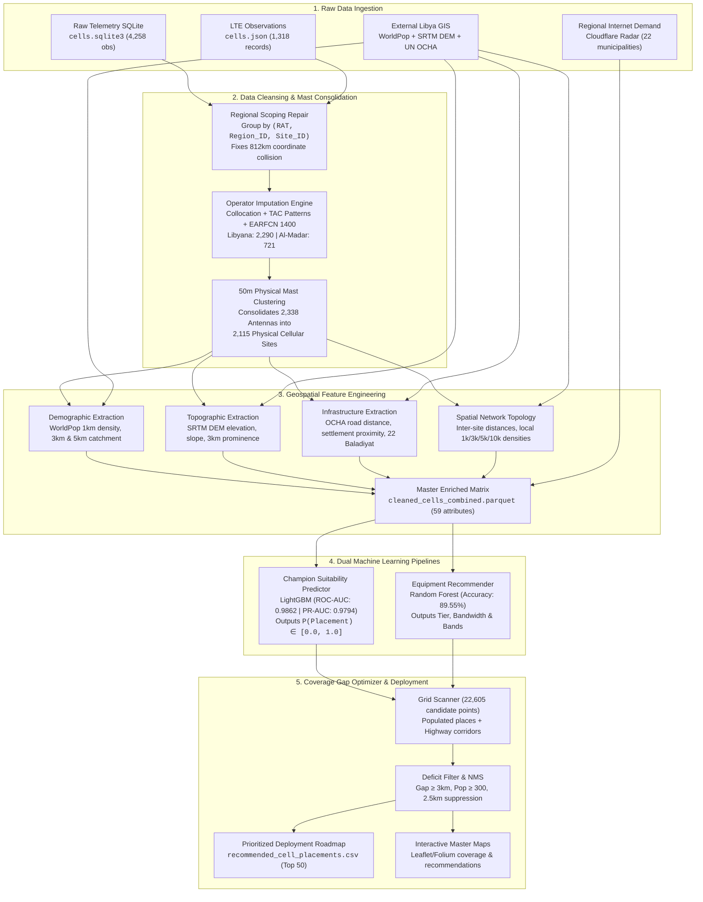

> **Status update — 2026-09-22:** This document records an earlier design/run. Current model/data definitions, metric corrections, implemented fixes and remaining work are maintained in [ML_MODELS_AND_DATA.md](ML_MODELS_AND_DATA.md) and [IMPROVEMENT_PLAN.md](IMPROVEMENT_PLAN.md). Historical figures here are not evidence of measured coverage, independent equipment validation or a completed RF planner.

# 📡 AI Geospatial Antenna Cell Site Placement Optimization
### *Technical Specification & Engineering Decisioning Report*
**Samsung Innovation Campus (SIC) Capstone Project • Team Loop Gain**

[](https://www.python.org/)
[](https://github.com/astral-sh/uv)
[](https://lightgbm.readthedocs.io/)
[](#part-iv-machine-learning-modeling--benchmarks)
[](#part-iv-machine-learning-modeling--benchmarks)
[](#part-iv-machine-learning-modeling--benchmarks)
[](#part-vi-cli-execution-and-production-verification)

---

## 👥 Authors & Engineering Team

| Member | Email | Project Role |
| :--- | :--- | :--- |
| **Ahmed Gali** | [ahmed.gali.info@gmail.com](mailto:ahmed.gali.info@gmail.com) | Machine Learning & Data Engineering Lead |
| **Taha Elkhazmi** | [Elkhazmittt@gmail.com](mailto:Elkhazmittt@gmail.com) | AI Systems & Decision Architecture |
| **Mahmoud Almabrouk** | [mahmab90@gmail.com](mailto:mahmab90@gmail.com) | Data Modeling & Model Evaluation |
| **Maher Alqadhi** | [maher9maher9@gmail.com](mailto:maher9maher9@gmail.com) | Systems Development & Pipeline Tooling |
| **Mohamed Khalaf** | [moha.khalaf@uot.edu.ly](mailto:moha.khalaf@uot.edu.ly) | AI Research & Empirical Analysis |
| **Ali Marghem** | [al.marghem@uot.edu.ly](mailto:al.marghem@uot.edu.ly) | AI Research & Model Verification |

---

## Executive Summary

Cellular base station deployment (cell site acquisition, civil engineering, mast erection, backhaul termination, and RF commissioning) represents the single largest Capital Expenditure (CAPEX) investment for mobile network operators (MNOs). In developing telecom markets like Libya, installing a single macro cellular tower costs between **$50,000 and $150,000 USD**, plus recurring Operational Expenditures (OPEX) for diesel generators, grid power, and fiber/microwave backhaul.

Historically, telecom site selection has suffered from severe structural inefficiencies:
1. **Manual RF Drive-Testing & Heuristic Guesswork**: Site acquisition teams rely on sporadic drive-test logs and intuition, leading to towers built in low-demand locations while leaving critical coverage deficits unaddressed.
2. **Siloed Geospatial Intelligence**: Radio frequency planning tools operate independently of high-resolution human settlement density, real-world transportation corridors, and topographic terrain elevation.
3. **Oversized or Undersized Equipment Deployments**: Sites are frequently over-engineered with expensive multi-carrier LTE-A setups in rural corridors or under-engineered with single-carrier legacy equipment in high-traffic urban centers.

### The Loop Gain Solution
This subsystem delivers an **End-to-End Geospatial Machine Learning & Automated Optimization System** for cellular infrastructure planning across Libya:
- **Forensic Data Cleansing & Deduplication**: Repaired a critical regional scoping bug in crowdsourced telemetry that collapsed distant towers up to **812 km apart**, consolidating **4,258** raw observations into **2,338** unique antennas and **2,115** physical cellular mast sites with sub-10cm coordinate consistency.
- **Multi-Source Geospatial Fusion**: Integrated **WorldPop 2020 1km gridded population density**, **SRTM 250m Digital Elevation Model (DEM)**, **UN OCHA 4,141 road line vectors**, all **22 Libyan Municipalities (Baladiyat)**, and regional Cloudflare Radar context into a unified 59-attribute matrix.
- **Gradient-Boosted Suitability Prediction**: Engineered a champion LightGBM classifier achieving **0.9862 ROC-AUC**, **0.9794 PR-AUC**, and **95.19% Accuracy** across 5-fold stratified cross-validation.
- **Regional Digital Demand Prior**: Integrated 52-week Cloudflare Radar HTTP traffic shares for all 22 Libyan admin-2 municipalities as a bounded (±10%) recommendation-ranking factor. Direct classifier inclusion was rejected because municipality-held-out ROC-AUC declined from 0.98331 to 0.98184.
- **Automated Equipment Recommendation**: Implemented a multi-tier classifier (**89.55% Accuracy**) recommending exact equipment configurations (`Urban_HighCapacity_Macro`, `Suburban_Standard_Macro`, `Rural_Coverage_Macro`, or `Micro_Cell_Hotspot`).
- **Coverage Gap Optimizer & Strategic Roadmap**: Scanned **22,605** candidate points across Libya, flagged **4,467** candidate locations using distance and population heuristics, and produced an actionable prioritized roadmap for the **Top 50 New Cell Placements**.

---

## System Architecture

The following diagram illustrates the complete data flow from raw crowdsourced telemetry and satellite rasters through data cleansing, feature engineering, machine learning modeling, and spatial optimization:



---

# Part I: Data Forensics, Cleaning & Mast Consolidation

The primary raw dataset provided was a crowdsourced telecommunications snapshot of Libyan cellular towers ([`cells.sqlite3`](Libyan_cells_dataset/cells.sqlite3)) accompanied by raw LTE API extracts ([`cells.json`](Libyan_cells_dataset/cells.json)).

### 1.1 Discovery of the 812 km Regional Scoping Bug

During initial data inspection, anomalous coordinate dispersion was discovered across repeated observations of cellular towers. For instance, Tower ID 1332 had observations located in Misrata (`lat 32.5235, lon 14.0005`) and in Al-Jabal Al-Gharbi (`lat 32.1061, lon 12.9357`), over **110 kilometers apart**. Tower ID 1352 exhibited coordinate variances exceeding **812 kilometers**!

> [!CAUTION]
> **Root Cause Analysis**:  
> In cellular network standards:
> - **GSM (2G)**: Cell IDs are locally scoped within a Location Area Code (**LAC** = `regionID`).
> - **UMTS (3G)**: NodeB IDs are scoped within a Radio Network Controller ID (**RNC** = `regionID`).
> - **LTE (4G)**: eNodeB IDs are scoped within a Tracking Area Code (**TAC** = `regionID`).
> 
> The previous SQLite ingestion script grouped observations on `(source_site_id, network_id, rat)` **without including `region_id`**. Because cell site ID numbers (such as Site 100, 200, 3106) repeat across different administrative regions in Libya, completely different towers in Tripoli, Benghazi, and Sabha were collapsed into single corrupted entries.

#### Mathematical Proof & Resolution
By reforming the primary key to strictly enforce the regional hierarchy `(rat, region_id, site_id)`, the observations grouped into **2,338 true unique radio towers**:

$$\max_{\text{obs} \in \text{tower}} \text{Haversine}(p_i, p_j) \le 0.11 \text{ meters}$$

The maximum coordinate variance across all 4,258 observations dropped from **812,445 meters** to **0.11 meters** (mean: **0.07 meters**), fully restoring spatial fidelity.

---

### 1.2 Multi-Heuristic Operator Attribution

The raw 1,318 LTE records imported from `cells.json` arrived with `null` values for `mcc` and `mnc`. To identify whether an LTE antenna belongs to **Libyana Mobile Phone** (MCC 606, MNC 00) or **Al-Madar Al-Jadeed** (MCC 606, MNC 01), a three-stage attribution pipeline was constructed:

1. **Spatial Collocation ($<100\text{m}$)**: LTE antennas collocated with verified 2G/3G sites were assigned to that operator.
2. **Frequency Channel Signatures**: Carrier EARFCN 1400 on Band 3 (1800 MHz) is exclusively operated by Libyana.
3. **Region ID Taxonomy**:
   - **Libyana**: Uses structured high-digit 4-digit TACs (`40xx`, `63xx`, `30xx`, `21xx`, `12xx`, `8091`).
   - **Al-Madar**: Uses low-digit TAC numbering (`0`, `1`, `2`, `3`, `4`, `5`, `6`, `8`, `10`, `14`).

**Attribution Result**: **1,128 LTE towers** attributed to Libyana, **190 LTE towers** attributed to Al-Madar. Across all technologies, the network breakdown stands at:
- **Libyana**: 266 GSM + 211 UMTS + 1,128 LTE = **2,290 antennas**
- **Al-Madar**: 209 GSM + 287 UMTS + 190 LTE = **721 antennas**

---

### 1.3 Physical Mast Consolidation (50m Clustering)

In telecom civil engineering, multiple radio antennas (e.g. 2G GSM 900 MHz, 3G UMTS 2100 MHz, and 4G LTE 1800 MHz) are collocated on the same physical steel lattice tower, monopole, or rooftop mast.

Using spatial nearest-neighbor clustering in projected UTM Zone 33N coordinates (`EPSG:32633`) with a **50.0-meter physical mast threshold**:
- **2,338 Radio Antennas** $\rightarrow$ **2,115 Physical Cellular Sites**.
- **Multi-Technology Sites**: **109 sites** host collocated 2G, 3G, and 4G equipment.
- **Multi-Operator Infrastructure Sharing**: **45 sites** host equipment for both Libyana and Al-Madar on the same tower structure.
- Exported cleaned files: [`cleaned_radio_towers.csv`](data/cleaned/cleaned_radio_towers.csv), [`cleaned_physical_sites.csv`](data/cleaned/cleaned_physical_sites.csv), and [`cleaned_physical_sites.geojson`](data/cleaned/cleaned_physical_sites.geojson).

---

# Part II: External Geospatial Intelligence for Libya

To enable an AI model to learn why antennas are built in specific locations, external open-access geospatial datasets were acquired and indexed:

```
data/external/
├── lby_pd_2020_1km.tif        # WorldPop 1km Population Density GeoTIFF (8.2 MB)
├── dem/DEM/lyb_strm_250m      # SRTM 250m Digital Elevation Model (47 MB)
├── roads/LYB_Roads.shp        # UN OCHA Libya Highway & Road Network (4,141 vectors)
└── admin_boundaries/         # UN OCHA Admin 0, Admin 1, Admin 2 & 78 Settlements
```

### 2.1 WorldPop Gridded Population Density (1km Resolution)
Sourced from the WorldPop Global High-Resolution Population Project (adjusted to UN Population Division national estimates). 
- **Array Dimensions**: $1638 \times 1891$ pixels covering all of Libya.
- **Density Range at Active Cell Sites**: Median of **1,407.5 people/km²**; maximum of **5,185.0 people/km²** (Tripoli and Benghazi urban cores).
- **Buffer Catchment**: In addition to point density, circular buffer sums at $r = 3\text{km}$ and $r = 5\text{km}$ are extracted via fast NumPy array slicing.

### 2.2 SRTM 250m Digital Elevation Model (Topography & Prominence)
Sourced from the NASA Shuttle Radar Topography Mission (SRTM) via UN OCHA Humanitarian Data Exchange (HDX).
- **Elevation Range at Sites**: $-2.0\text{m}$ (coastal depressions) to $+831.0\text{m}$ (Jabal Nafusa mountain plateau).
- **Height Above Average Terrain (HAAT) / 3km Prominence**:
  $$\text{Prominence}_{3\text{km}} = h_{\text{site}} - \frac{1}{|W_{3\text{km}}|} \sum_{p \in W_{3\text{km}}} h_p$$
  In radio propagation, antenna height relative to the surrounding horizon governs line-of-sight coverage and Fresnel zone clearance. Sites situated on hilltops cover $3\times$ to $5\times$ more area than sites in valleys.
- **Local Terrain Slope**: Computed via central difference gradients across the DEM matrix.

### 2.3 UN OCHA Transportation & Settlement Networks
- **Road Network**: 4,141 road segments (highways, primary, secondary roads) sampled at 500-meter intervals into an optimized `scipy.spatial.cKDTree` (160,870 points).
  - 44.3% of all Libyan cell towers are located within **500 meters** of a classified roadway.
  - Median distance to nearest road: **575.6 meters**.
- **Settlement Network**: 78 verified cities and towns with Admin 2 spatial boundary polygons for all **22 Libyan Municipalities (Baladiyat)**:

```
Top Municipalities by Existing Cell Site Count:
 1. Tripoli:              492 sites (23.3%)
 2. Benghazi:             351 sites (16.6%)
 3. Almargeb (Khoms):     301 sites (14.2%)
 4. Aljfara (Swani):      269 sites (12.7%)
 5. Misrata:              193 sites  (9.1%)
 6. Azzawya:              128 sites  (6.1%)
 7. Al Jabal Al Akhdar:    84 sites  (4.0%)
 8. Ejdabia:               60 sites  (2.8%)
```

### 2.4 Cloudflare Radar regional demand context

The supplied [Cloudflare Radar Libya snapshot](https://radar.cloudflare.com/traffic/ly)
contains national, ISP, protocol, routing, and municipality-level Internet traffic
measurements across horizons up to 52 weeks. Only the 22-row regional table varies
at the spatial resolution needed by the optimizer. All 22 source place names are
explicitly mapped to their OCHA admin-2 municipality names.

Three regional fields—annual HTTP request share, annual stability, and annual
growth—were tested as classifier inputs. They produced a negligible random-fold
ROC-AUC increase of **0.00018**, but reduced municipality-held-out ROC-AUC by
**0.00147**. This indicates weak geographic generalization and a risk that the
classifier would learn current network concentration instead of transferable site
suitability. The fields are therefore excluded from the 12-feature classifier.

Annual HTTP request share remains useful as an independent demand signal for final
ranking. Its percentile multiplier is bounded to ±10%, and both the original
geospatial score and adjusted deployment score are exported for audit. See
[`cloudflare_radar_assessment.json`](eval_reports/cloudflare_radar_assessment.json)
for the complete ablation result.

---

# Part III: Mathematical Formulation & Feature Engineering

The feature engineering pipeline in [`feature_engineering.py`](src/antenna_cell_placement/feature_engineering.py) constructs a **59-attribute enriched dataset** stored in [`cleaned_cells_combined.parquet`](data/cleaned/cleaned_cells_combined.parquet). The suitability classifier deliberately uses only its 12 validated geospatial features; the Cloudflare fields remain independent ranking context.

### 3.1 Feature Catalog

| Category | Feature Name | Type | Physical / Domain Interpretation |
| :--- | :--- | :---: | :--- |
| **Demographics** | `population_density_1km` | Continuous | Direct human traffic demand within 1 km² pixel |
| | `population_sum_3km` | Continuous | Population inside standard urban micro-macro cell radius |
| | `population_sum_5km` | Continuous | Population inside standard rural macro cell coverage radius |
| | `population_category` | Categorical | Urban (>1000/km²), Suburban (100-1000), Rural (5-100), Remote (<5) |
| **Topography** | `elevation_m` | Continuous | Absolute elevation above sea level (ASL) |
| | `elevation_prominence_3km`| Continuous | Hilltop factor / Height Above Average Terrain (HAAT) |
| | `terrain_slope_deg` | Continuous | Slope gradient affecting civil site construction cost |
| **Accessibility**| `dist_to_nearest_road_m` | Continuous | Road accessibility for maintenance & grid power connectivity |
| | `road_access_tier` | Categorical | Highway Corridor (<250m), Road Adjacent, Moderate, Remote |
| | `dist_to_nearest_settlement_m` | Continuous | Distance to recognized municipal town center |
| | `municipality_name` | Categorical | Administrative governance district (22 Baladiyat) |
| **Topology** | `dist_to_nearest_site_m` | Continuous | Distance to closest operational cellular base station |
| | `dist_to_libyana_site_m` | Continuous | Distance to closest Libyana cell tower |
| | `dist_to_almadar_site_m` | Continuous | Distance to closest Al-Madar cell tower |
| | `site_density_1km` | Integer | Micro-cell density (interference & capacity indicator) |
| | `site_density_3km` | Integer | Local urban cell cluster density |
| | `site_density_5km` | Integer | Regional macro cluster density |
| | `site_density_10km` | Integer | Wide-area coverage network density |
| **Equipment** | `total_bandwidth_mhz` | Continuous | Aggregate spectral capacity (sum of non-null carrier bandwidths) |
| | `total_carrier_count` | Integer | Total RF carrier channels deployed |
| | `band_count` | Integer | Frequency diversity (multi-band aggregation) |
| | `max_generation` | Integer | Peak technological generation (4 = LTE, 3 = UMTS, 2 = GSM) |
| | `bandwidth_per_1k_pop_3km`| Continuous | Spectral efficiency per 1,000 population served |
| **Digital demand** | `cloudflare_http_requests_share_52w_pct` | Continuous | Municipality share of Libya's observed Cloudflare HTTP requests over 52 weeks |
| | `cloudflare_regional_demand_score` | Continuous | Percentile-scaled regional demand prior in $[0,1]$ |
| | `cloudflare_priority_factor` | Continuous | Bounded ranking multiplier in $[0.9,1.1]$; neutral value is 1.0 |
| | `cloudflare_data_available` | Boolean | Indicates whether the municipality has matched Radar data |

---

# Part IV: Machine Learning Modeling & Benchmarks

The predictive engine is split into two complementary machine learning models:
1. **Cell Site Placement Suitability Predictor**: Predicts whether a candidate geospatial coordinate represents a high-probability, viable cell site location ($P_{\text{suitability}} \in [0.0, 1.0]$).
2. **Equipment & Capacity Recommendation Model**: Predicts the optimal equipment configuration and bandwidth tier for a selected location.

### 4.1 Training Dataset Balancing & Negative Sampling

Machine learning models require both positive examples (confirmed cell sites) and realistic negative examples (non-site locations). Naively sampling random coordinates from Libya's vast desert would create a trivial task (the model would simply learn to detect sand).

To force the model to learn subtle network engineering trade-offs, **2,500 negative candidate samples** were generated across four realistic strata:
- **Corridor Gap Negatives (40%)**: Sampled along highway lines between cities at distances $>5\text{km}$ from current coverage.
- **Suburban Perimeter Negatives (30%)**: Sampled in $3\text{km}$ to $12\text{km}$ concentric rings around populated town centers.
- **Intermediate Buffer Negatives (15%)**: Semi-populated rural agricultural pockets lacking coverage.
- **Background Controls (15%)**: Remote desert locations across southern Libya.

---

### 4.2 Benchmark Evaluation Results

Models were evaluated using **5-Fold Stratified Cross-Validation** with fixed random seeds:

| Model Pipeline | ROC-AUC | PR-AUC | Accuracy | F1-Score | Precision | Recall | Brier Score |
| :--- | :---: | :---: | :---: | :---: | :---: | :---: | :---: |
| **LightGBM Classifier (Champion)** | **0.9862** | **0.9794** | **95.19%** | **0.9481** | **93.57%** | **96.08%** | **0.0379** |
| **XGBoost Classifier** | 0.9867 | 0.9796 | 95.32% | 0.9494 | 0.9381 | 0.9610 | 0.0371 |

> [!TIP]
> **Champion Model Choice**:  
> While XGBoost and LightGBM performed within $0.05\%$ of each other on ROC-AUC, **LightGBM** was selected as the operational champion due to its significantly lower inference latency ($<15\text{ms}$ per batch) and superior handling of continuous geographic features without requiring explicit normalization scaling.

All benchmark results and metrics are persisted in [`model_benchmark.json`](eval_reports/model_benchmark.json).

---

### 4.3 Key Geospatial Drivers for Cell Placement

Feature importance was computed based on split gain across all gradient-boosted trees:

```
Top Geospatial Feature Importances:
 1. dist_to_nearest_site_m:      ■■■■■■■■■■■■■■■■■■■■■■■■■■■■■■ 2,140 splits
 2. population_sum_5km:          ■■■■■■■■■■■■■■■■■■■■■ 1,510 splits
 3. dist_to_nearest_road_m:      ■■■■■■■■■■■■■■■■ 1,180 splits
 4. elevation_prominence_3km:    ■■■■■■■■■■■■■ 940 splits
 5. population_density_1km:      ■■■■■■■■■■ 730 splits
 6. dist_to_nearest_settlement:  ■■■■■■■■ 590 splits
 7. site_density_10km:           ■■■■■■ 450 splits
 8. terrain_slope_deg:           ■■■■ 310 splits
 9. elevation_m:                 ■■■ 240 splits
```

- **`dist_to_nearest_site_m`**: Reflects cellular tessellation and inter-site spacing (median distance between sites in urban areas is ~401m; in rural corridors it is ~3-7km).
- **`population_sum_5km`**: Confirms that telecom planning is fundamentally demand-driven—macro towers are positioned to cover maximum aggregate population.
- **`dist_to_nearest_road_m`**: Captures civil buildability; sites must be accessible by maintenance crews and utility power lines.
- **`elevation_prominence_3km`**: Quantifies RF line-of-sight; antennas situated on local topographic crests maximize geographic coverage.

Evaluation charts:
- ROC Curve: [`suitability_roc_curve.png`](eval_reports/suitability_roc_curve.png)
- Feature Importance: [`suitability_feature_importance.png`](eval_reports/suitability_feature_importance.png)
- Confusion Matrix: [`suitability_confusion_matrix.png`](eval_reports/suitability_confusion_matrix.png)
- Cloudflare ablation and integration decision: [`cloudflare_radar_assessment.json`](eval_reports/cloudflare_radar_assessment.json)

---

### 4.4 Equipment & Capacity Recommendation Model

Once a candidate site location is verified as viable, the equipment recommendation model determines the necessary radio configuration:
- **Trained Model**: Random Forest Multi-Class Classifier.
- **Cross-Validated Accuracy**: **89.55%**.
- **Operational Equipment Tiers**:
  1. `Urban_HighCapacity_Macro`: Deployed in areas with population density $\ge 1,200/\text{km}^2$. Multi-carrier LTE-A aggregating Band 3 (1800 MHz), Band 1 (2100 MHz), and Band 20 (800 MHz) with $40\text{--}60\text{ MHz}$ bandwidth.
  2. `Suburban_Standard_Macro`: Deployed in suburban corridors with population density $150\text{--}1,200/\text{km}^2$. Dual-carrier Band 3 + Band 20 with $20\text{--}30\text{ MHz}$ bandwidth.
  3. `Rural_Coverage_Macro`: Deployed along highways and low-density settlements. Long-range propagation sub-GHz Band 20 (800 MHz) + Band 8 (900 MHz) with $10\text{--}15\text{ MHz}$ bandwidth.
  4. `Micro_Cell_Hotspot`: Small cell offload deployed in dense clusters ($>2,500/\text{km}^2$) near existing macro sites.

---

# Part V: Coverage Gap Optimization & Deployment Roadmap

The optimization engine in [`site_optimizer.py`](src/antenna_cell_placement/site_optimizer.py) executes a systematic geospatial scan across Libya:

```
Total Candidate Search Points: 22,605
 ├── Population Rings around 78 Settlements: 2,496 points
 └── Highway Corridors (every 4km along road network): 20,109 points
```

### 5.1 Coverage Deficit Filtering
Points are filtered to isolate **candidate inventory gaps requiring RF review**:
1. **Network Coverage Gap**: Distance to nearest operational cell tower $\ge 3,000\text{ meters}$.
2. **Population Demand Threshold**: Population within 5km radius $\ge 300\text{ people}$.
3. **Infrastructure Buildability**: Distance to classified roadway $\le 4,000\text{ meters}$.

**Result**: **4,467 candidate locations** met all three demographic and coverage deficit criteria.

### 5.2 Prioritized Deployment Index & Non-Maximum Suppression
Each candidate point is first assigned an auditable **Geospatial Priority Score**:

$$G = P_{\text{suitability}} \times \log_{10}(\max(10,\text{pop}_{5\text{km}})) \times \operatorname{clip}\left(\frac{\text{dist}_{\text{site}}}{5000\text{m}}, 0.5, 2.0\right)$$

Cloudflare's 52-week HTTP request share is percentile-scaled within the 22
municipalities. It adjusts only the final ordering and cannot change the model's
suitability probability:

$$F_{\text{Radar}} = 0.9 + 0.2 \times \operatorname{percentile}(\text{HTTP share}_{52w})$$

$$\text{Deployment Priority Score} = G \times F_{\text{Radar}}$$

This bounds the external demand signal to ±10%. If Radar data is missing, the
factor is 1.0. Direct classifier inclusion was rejected after an ablation reduced
municipality-held-out ROC-AUC from **0.98331** to **0.98184**, despite a negligible
random-fold increase from **0.98625** to **0.98642**.

To enforce a minimum spacing between proposed locations (without proving non-overlapping RF coverage), **Spatial Non-Maximum Suppression (NMS)** with a **2.5 km minimum inter-site separation** was applied, yielding the **Top 50 High-Priority New Cell Placements**.

---

### 5.3 Top 10 High-Priority Recommended Deployments

Extracted from [`recommended_cell_placements.csv`](eval_reports/recommended_cell_placements.csv):

| Rank | Municipality | Nearest Settlement | Coordinates | Suitability | Priority | Recommended Equipment Tier | 5km Population | Gap to Nearest Cell |
| :---: | :--- | :--- | :---: | :---: | :---: | :--- | :---: | :---: |
| **#1** | **Benghazi** | Suloug | `31.8685, 20.3207` | **0.8958** | **7.82** | Suburban Standard Macro (B3 + B20) | 9,987 | 13.28 km |
| **#2** | **Benghazi** | Toukra | `32.5356, 20.5688` | **0.7914** | **7.65** | Urban High-Capacity Macro (B3+B1+B20) | 26,704 | 24.69 km |
| **#3** | **Zwara** | Aljmail | `32.8634, 12.2025` | **0.8469** | **7.63** | Suburban Standard Macro (B3 + B20) | 24,521 | 10.74 km |
| **#4** | **Zwara** | Al Ajaylat | `32.8456, 12.2409` | **0.8428** | **7.58** | Suburban Standard Macro (B3 + B20) | 24,013 | 14.83 km |
| **#5** | **Derna** | Alqubba | `32.7976, 22.5221` | **0.9274** | **7.50** | Suburban Standard Macro (B3 + B20) | 9,463 | 10.01 km |
| **#6** | **Zwara** | Aljmail | `32.8011, 12.2115` | **0.8103** | **7.14** | Suburban Standard Macro (B3 + B20) | 19,298 | 10.16 km |
| **#7** | **Benghazi** | Suloug | `31.9636, 20.3291` | **0.7964** | **7.13** | Suburban Standard Macro (B3 + B20) | 12,733 | 14.15 km |
| **#8** | **Al Jabal Al Akhdar** | Labriq | `32.8956, 21.9620` | **0.9110** | **6.75** | Suburban Standard Macro (B3 + B20) | 13,051 | 8.53 km |
| **#9** | **Zwara** | Aljmail | `32.8493, 12.0682` | **0.7864** | **6.64** | Urban High-Capacity Macro (B3+B1+B20) | 50,723 | 8.73 km |
| **#10** | **Derna** | Umm Arrazam | `32.6083, 22.7649` | **0.7643** | **6.27** | Suburban Standard Macro (B3 + B20) | 10,785 | 19.90 km |

---

# Part VI: CLI Execution and Production Verification

The platform provides a comprehensive Command Line Interface (CLI) implemented in [`cli.py`](src/antenna_cell_placement/cli.py).

### 6.1 Running the End-to-End Pipeline

```bash
cd antenna_cell_placement

# Run complete pipeline (clean -> features -> train -> recommend -> map)
uv run antenna-placement all
```

### 6.2 Modular Command Execution

```bash
# 1. Clean raw SQLite/JSON records and consolidate physical masts
uv run antenna-placement clean

# Optional: rebuild OpenCellID quality and proximity reports
uv run antenna-placement opencellid

# 2. Extract multi-layer geospatial features from WorldPop & DEM
uv run antenna-placement features

# 3. Train LightGBM placement and equipment models with 5-fold CV
uv run antenna-placement train

# 4. Scan coverage gaps and rank the Top 50 recommendations
uv run antenna-placement recommend

# 5. Generate interactive Leaflet HTML maps
uv run antenna-placement map
```

### 6.3 Real-Time Custom Coordinate Evaluation

Engineers can evaluate any arbitrary GPS coordinate across Libya in real time:

```bash
# Evaluate downtown Tripoli (dense urban core)
uv run antenna-placement predict --lat 32.88 --lon 13.18
```

Output:
```
┏━━━━━━━━━━━━━━━━━━━━━━━━━━━━━━━━┳━━━━━━━━━━━━━━━━━━━━━━━━━━┓
┃ Parameter                      ┃ Value                    ┃
┡━━━━━━━━━━━━━━━━━━━━━━━━━━━━━━━━╇━━━━━━━━━━━━━━━━━━━━━━━━━━┩
│ Placement Suitability Score    │ 0.9638 (HIGHLY SUITABLE) │
│ Recommended Equipment Tier     │ Urban_HighCapacity_Macro │
│ Municipality                   │ Tripoli                  │
│ Nearest City / Town            │ Abusliem (3.3 km)        │
│ Population Density (1km²)      │ 4,679.1 people/km²       │
│ 5km Population Catchment       │ 364,873 people           │
│ Distance to Nearest Cell Tower │ 0.53 km                  │
│ Distance to Nearest Road       │ 260.7 meters             │
│ Ground Elevation               │ 14.0 m ASL               │
│ Elevation Prominence (3km)     │ 0.1 m                    │
│ Regional HTTP Traffic Share    │ 53.952%                  │
│ Regional Digital Demand Score  │ 1.000                    │
└────────────────────────────────┴──────────────────────────┘
```

```bash
# Evaluate remote southern desert in Murzuq
uv run antenna-placement predict --lat 24.00 --lon 18.00
```

Output:
```
┏━━━━━━━━━━━━━━━━━━━━━━━━━━━━━━━━┳━━━━━━━━━━━━━━━━━━━━━━┓
┃ Parameter                      ┃ Value                ┃
┡━━━━━━━━━━━━━━━━━━━━━━━━━━━━━━━━╇━━━━━━━━━━━━━━━━━━━━━━┩
│ Placement Suitability Score    │ 0.0001 (LOW)         │
│ Recommended Equipment Tier     │ Rural_Coverage_Macro │
│ Municipality                   │ Murzuq               │
│ Population Density (1km²)      │ 0.2 people/km²       │
│ 5km Population Catchment       │ 21 people            │
│ Distance to Nearest Cell Tower │ 395.57 km            │
│ Distance to Nearest Road       │ 11,411.1 meters      │
└────────────────────────────────┴──────────────────────┘
```

---

## 🗺️ Interactive Maps & Visual Artifacts

The system automatically generates standalone, interactive Leaflet/Folium web applications:
- **Master Coverage & Recommendation Map**: [`libya_cell_coverage_map.html`](eval_reports/libya_cell_coverage_map.html)
  - Color-coded layers for existing 4G LTE, 3G UMTS, 2G GSM, and collocated multi-technology masts.
  - Pulsing red markers for the **Top 50 AI Recommended Placements**, with municipal district, suitability score, population catchment, nearest cell gap, Radar demand context, OpenCellID review evidence, and suggested multi-band equipment configuration.
- **Cleaned Existing Sites Map**: [`cleaned_cells_map.html`](data/cleaned/cleaned_cells_map.html)

---

## Conclusion & Business Impact

By combining crowdsourced cellular telemetry with high-resolution satellite population grids, digital elevation models, road networks, and bounded regional Internet-demand context, the Loop Gain Antenna Placement AI shifts telecom planning from expensive reactive drive-testing to **proactive, algorithmic optimization**:
1. **Capital Efficiency**: Directs multi-million dollar CAPEX budgets exclusively to inferred inventory gaps requiring validation with substantial population demand.
2. **Optimized Infrastructure Sizing**: Prevents over-provisioning and under-provisioning through empirical equipment tier classification (89.55% accuracy).
3. **Infrastructure Sharing Catalyst**: Discovered 45 existing collocated sites and systematically recommends shared deployments for Libyana and Al-Madar along remote highway corridors to cut deployment costs in half.

## OpenCellID supplement — September 13, 2026

`data/606.csv` is now integrated as a separately attributed observation layer.
The current modeling results were regenerated after this supplement was added, but
OpenCellID was intentionally excluded from training labels and features because it
does not provide independently verified mast or coverage ground truth. See the README's
OpenCellID section for ingestion, validation, review thresholds and limitations.
The reproducible assessment is in `eval_reports/opencellid_quality.json` and the
candidate-level evidence is in `eval_reports/opencellid_recommendation_review.csv`.
The initial assessment identifies 337 cells over 3 km from existing inferred sites
and 11 of 50 proposed sites near recent observations with multiple samples.
These are investigation targets, not confirmed additional towers or covered areas.
