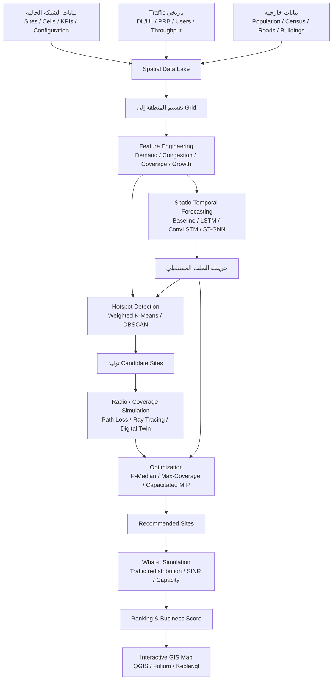

# اختيار مواقع محطات الاتصالات وتوسعة شبكات المحمول باستخدام التعلم الآلي والتحسين المكاني

## الملخص التنفيذي

تُظهر الأدبيات أن فكرة **وضع المواقع الحالية على خريطة ثم استخدام التعلم الآلي لاختيار موقع المحطة التالية** سليمة جداً كبداية، لكن أفضل النماذج البحثية لا تتعامل معها بوصفها مسألة Clustering فقط. الاتجاه الأقوى هو فصل المشكلة إلى ثلاث طبقات مترابطة: **تقدير أين سيكون الطلب والمشكلة، توليد مواقع مرشحة، ثم اختيار أفضل مجموعة مواقع تحت قيود التغطية والسعة والتكلفة**. هذا المنطق يعود إلى أعمال مبكرة صاغت اختيار المحطات كمسائل Facility Location/Maximum Coverage، واستمر إلى نماذج حديثة تدمج التنبؤ بالطلب، والمحاكاة الراديوية، والـDigital Twins، والتحسين الرياضي أو التعلم المعزز. citeturn17search0turn18search0turn22search2turn20academia30

الخلاصة العملية الأهم هي أن **K-Means وحده ليس Site-Selection Algorithm كاملاً**. هو ممتاز لاكتشاف مراكز الطلب أو الـhotspots، ونسخته الموزونة Weighted K-Means أكثر ملاءمة عندما تكون النقاط ذات أحجام حركة مرور مختلفة، لكن centroid رياضي لا يعرف شيئاً تلقائياً عن التغطية الراديوية، اتجاه الهوائيات، الـSINR، السعة، الطرق، توفر العقار، backhaul، أو وجود محطة حالية قريبة. DBSCAN مفيد عندما تكون hotspots غير منتظمة هندسياً؛ وKNN أنسب لتقدير KPI في نقطة غير مرصودة من نقاط مشابهة/قريبة، لا لاتخاذ قرار الاستثمار مباشرة. الأساس النظري لـK-Means يعود إلى MacQueen، ولـDBSCAN إلى Ester وزملائه، ولـKNN إلى Cover وHart. citeturn15search1turn15search0turn15search2

الأقرب للمشكلة الاستثمارية هو **Facility Location**. في نموذج P-Median نختار المواقع التي تقلل المسافة أو الكلفة الموزونة بين الطلب والمحطات؛ في Maximal Coverage نختار عدداً محدوداً من المواقع لتعظيم الطلب المغطى؛ وفي Capacitated Facility Location نضيف قيود سعة لكل محطة. الجذور الرياضية لهذا الخط تشمل Hakimi في مسائل median/center على الشبكات وChurch–ReVelle في Maximal Covering Location Problem. citeturn16search0turn16search5

لذلك أوصي بنموذج هجين:

**Forecasting → Hotspot Detection → Candidate Sites → Radio Simulation → Facility-Location Optimization → What-if Validation → Ranking.**

وهذا يتوافق أكثر مع تطور البحث نفسه: Tutschku صاغ تخطيط شبكات المحمول المعتمد على الطلب كمسألة تغطية؛ Amaldi وCapone وMalucelli دمجوا موقع المحطة مع SIR والطاقة والتكلفة؛ Ghazzai وزملاؤه أدخلوا تغير كثافات المستخدمين مكانياً وزمنياً؛ والأبحاث الأحدث في 2026 تستخدم Digital Twins وDRL وبيانات جغرافية مفتوحة للوصول إلى قرارات نشر كاملة. citeturn17search0turn18search0turn22search2turn20academia30

وبالنسبة لمشروع عملي لدى مشغل Mobile Network Operator، أفضل نقطة انطلاق ليست تدريب نموذج Deep Learning ضخم، بل بناء **نسخة أولى قابلة للتفسير** من: historical traffic/KPIs + geographical grid + demand forecast بسيط + Weighted K-Means/DBSCAN + Max-Coverage أو P-Median في OR-Tools. بعد ذلك تُضاف propagation simulation وDigital Twin تدريجياً. هذا المسار يعطيك benchmark واضحاً لمعرفة هل التعقيد الإضافي فعلاً يحسن القرار أم لا. OR-Tools يدعم نماذج التحسين التوافقي وCP-SAT، بينما يوفر GeoPandas وscikit-learn الأدوات الأساسية للتحليل المكاني والتجميع. citeturn11search6turn11search2turn11search0turn11search1

## الخوارزميات والنماذج الأكثر ارتباطاً بالمشكلة

يمكن النظر إلى منظومة اختيار الموقع على أنها أربع أسئلة مختلفة؛ الخلط بينها هو أكثر ما يؤدي إلى نموذج ضعيف.

**السؤال الأول: أين توجد تجمعات الطلب أو سوء الأداء؟** هنا تدخل K-Means وWeighted K-Means وDBSCAN. K-Means يحاول تقليل مجموع مربعات المسافات داخل كل cluster، وبالتالي يفترض ضمنياً أن الـcentroid يمثل المنطقة جيداً. يمكن إعطاء كل observation وزناً في implementations حديثة مثل scikit-learn، ما يجعل traffic أو number of users أو congestion يؤثر في مكان centroid أكثر من نقطة منخفضة الأهمية. DBSCAN لا يتطلب تحديد عدد clusters مسبقاً ويستطيع تمثيل تجمعات ذات أشكال غير كروية وفصل noise، ولذلك هو جذاب عندما تتبع المشكلة طرقاً أو أحياء أو مراكز تجارية غير منتظمة. citeturn15search1turn15search0turn11search1turn11search5

مثلاً يمكن بناء وزن grid \(i\) بهذه الصورة:

\[
w_i =
\alpha\,Traffic_i+
\beta\,PRB_i+
\gamma\,Users_i+
\delta\,ThroughputGap_i+
\epsilon\,CoverageGap_i+
\zeta\,Growth_i
\]

على أن تُحوّل المتغيرات أولاً إلى مقاييس قابلة للمقارنة. الـWeighted K-Means بعد ذلك يجيب عن سؤال: **أين مركز كتلة المشكلة؟** لكنه لا يثبت أن هذا المركز موقع راديو جيد.

**السؤال الثاني: ماذا نتوقع في مكان لا نملك فيه محطة؟** هنا KNN وSpatial Regression وGaussian Processes أكثر منطقية. KNN هو بالأساس nearest-neighbor classification/regression وليس facility-location algorithm؛ يمكن استخدامه مثلاً لتقدير throughput أو traffic أو expected load في candidate site من مناطق مشابهة. النماذج المكانية مثل Spatial Lag وSpatial Error تضيف الاعتماد المكاني الذي لا يمثله regression التقليدي جيداً، بينما Gaussian Processes توفر توزيعاً احتمالياً وليس مجرد point estimate، وهو مفيد عندما تكون القياسات sparse ونريد أيضاً uncertainty. citeturn15search2turn16search22turn15search3

**السؤال الثالث: ماذا سيحدث بعد ستة أو اثني عشر شهراً؟** هنا تصبح Time-Series وSpatio-Temporal ML مهمة. مراجعات الأدبيات الحديثة تبيّن انتقال المجال من ARIMA/نماذج زمنية أحادية إلى LSTM وConvLSTM ونماذج spatio-temporal وgraph-based، لأن traffic في خلية ليس مستقلاً عن الخلايا المجاورة وعن الساعة واليوم والموسم. مراجعة Jiang لعام 2022 ومراجعة Wang وزملائه لعام 2024 تصلحان كمدخلين جيدين لهذا الجزء. citeturn3search0turn23search15

**السؤال الرابع: من كل المواقع الممكنة، أين نبني فعلياً؟** هنا يأتي optimization. في P-Median تكون الصياغة المبسطة:

\[
\min \sum_i\sum_j w_i d_{ij}x_{ij}
\]

مع:

\[
\sum_j x_{ij}=1,\qquad
x_{ij}\le y_j,\qquad
\sum_j y_j=p
\]

حيث \(y_j=1\) إذا اخترنا الموقع \(j\)، و\(x_{ij}=1\) إذا خدمت المحطة \(j\) demand point \(i\). النموذج يقلل demand-weighted distance أو cost؛ وهو امتداد طبيعي لأعمال location/median الكلاسيكية. citeturn16search0turn16search28

أما Maximal Coverage فيكون تقريباً:

\[
\max \sum_i w_i z_i
\]

بحيث:

\[
z_i\le\sum_{j\in N(i)}y_j,
\qquad
\sum_j y_j\le p
\]

حيث \(N(i)\) هي المواقع التي تستطيع خدمة demand point \(i\) ضمن معيار coverage محدد. Church وReVelle قدما MCLP لهذا النوع من القرار، ثم استخدم Tutschku منطق Maximal Coverage مباشرة في تخطيط الشبكات الخلوية المعتمد على الطلب. citeturn16search5turn17search0

في شبكة حقيقية من الأفضل إضافة السعة:

\[
\sum_i Demand_i x_{ij}\le Capacity_j y_j
\]

ثم قيود هندسية وراديوية مثل eligibility، المسافة الدنيا من المواقع القائمة، backhaul feasibility، السعة المتاحة، candidate-land availability أو حد أدنى للـRSRP/SINR. وهنا يصبح النموذج **Capacitated Facility Location / Mixed Integer Programming** بدلاً من مجرد clustering. OR-Tools مناسب لتنفيذ كثير من هذه القيود بمتغيرات صحيحة ومنطقية عبر CP-SAT أو أدوات البرمجة الرياضية. citeturn16search29turn11search6turn11search2

بالتالي يمكن تلخيص الاستخدام الصحيح للخوارزميات هكذا:

| الطريقة | الدور الأفضل في مشروعك | لا ينبغي استخدامها وحدها لـ |
|---|---|---|
| K-Means | تقسيم demand/hotspots | اختيار الموقع الاستثماري النهائي |
| Weighted K-Means | hotspot centroid مع أوزان traffic/KPI | تمثيل propagation والسعة |
| DBSCAN | اكتشاف hotspots غير منتظمة وnoise | تحديد عدد المواقع الأمثل |
| KNN | تقدير KPI/traffic لموقع غير مرصود | Facility placement |
| Spatial Regression | تفسير وتوقع spatial dependence | combinatorial site selection |
| Gaussian Process | interpolation + uncertainty | شبكة ضخمة جداً دون approximation |
| LSTM/ConvLSTM/ST-GNN | forecast للطلب مكانياً وزمنياً | تحديد الموقع النهائي مباشرة |
| P-Median | تقليل demand-weighted distance/cost | coverage threshold الصريح إذا لم يُضف |
| Max-Coverage | تعظيم الطلب المغطى بعدد مواقع ثابت | load/capacity ما لم تُضف قيود |
| Capacitated Location | اختيار المواقع مع حدود السعة | propagation المعقد بلا radio layer |
| MIP/CP-SAT | تجميع القيود واتخاذ القرار النهائي | تعلم traffic من التاريخ |

## أهم الأبحاث والمراجعات ودراسات الصناعة

**Demand-based radio network planning of cellular mobile communication systems — Kurt Tutschku، 1998.** هذه من أكثر الأوراق ارتباطاً بفكرتك مباشرة. أدخلت مفهوم demand nodes ثم صاغت مهمة تحديد مواقع المرسلات كـMaximal Coverage Location Problem، واقترحت خوارزمية Set Cover Base Station Positioning ضمن نظام تخطيط ICEPT، مع تطبيق على حالة تخطيط فعلية. **المنهج:** demand modelling + MCLP/set-cover heuristic. **البيانات:** demand nodes وحالة تخطيط شبكة واقعية. **أهم النتيجة:** تحويل قرار الموقع من geometry فقط إلى موقع مرتبط بتوزيع الطلب. **الرابط:** IEEE INFOCOM. citeturn17search0turn17search6

**Optimum Positioning of Base Stations for Cellular Radio Networks — Rudolf Mathar وThomas Niessen، 2000.** تبحث الورقة مسألة positioning تحت خصائص الشبكة الراديوية وتعرض صياغات تحليلية/تحسينية لاختيار مواضع المحطات بدلاً من الاعتماد على قواعد هندسية بسيطة. **المنهج:** mathematical optimization وinteger formulations مرتبطة بتخطيط الخلايا. **البيانات:** حالات عددية/تخطيطية بدلاً من CDR dataset عام. **الأهمية:** من الأعمال المبكرة التي رسخت أن site positioning هو optimization problem وليس clustering فقط. **الرابط:** Springer, Wireless Networks 6, 421–428. citeturn17search1turn17search13

**Planning UMTS Base Station Location: Optimization Models With Power Control and Algorithms — Edoardo Amaldi، Antonio Capone، Federico Malucelli، 2003.** تصيغ الورقة اختيار مواقع UMTS مع power control وSIR وtraffic coverage وinstallation cost، وتوضح أن المسألة صعبة حسابياً ثم تختبر randomized greedy وreverse greedy وtabu search. **البيانات:** candidate sites وتوزيعات traffic وحالات مولدة باستخدام propagation models ويمكن تضمين ray-tracing information. **أهم النتيجة:** ضرورة معالجة الموقع والطاقة وجودة الإشارة والتغطية معاً، واستخدام heuristics عندما تصبح الحالات كبيرة. **الرابط:** IEEE Transactions on Wireless Communications. citeturn18search0

**Optimal Base Station Placement: A Stochastic Method Using Interference Gradient in Downlink Case — Salman Malik، Alonso Silva، Jean‑Marc Kelif، 2011.** تفترض الورقة شبكة موجودة نريد إضافة محطات إليها، وهو قريب جداً من سؤالك عن “الموقع التالي”. تستخدم Delaunay triangulation ثم gradient descent داخل المثلثات للعثور على أماكن تقلل interference، وتدرس أيضاً عدد المحطات التي ينبغي إضافتها. **البيانات:** منطقة اهتمام داخل شبكة قائمة ونماذج interference/coverage؛ ليست dataset عامة للتنزيل. **النتيجة:** تحسن coverage وuser throughput بعد الإضافات المحسوبة. **الرابط:** arXiv. citeturn18academia8

**Base Station Location Optimization for Minimal Energy Consumption in Wireless Networks — Pablo González‑Brevis، Jacek Gondzio، Yijia Fan، H. Vincent Poor، John Thompson، Ioannis Krikidis، Pei‑Jung Chung، 2011.** تعالج الدراسة عدد المحطات ومواقعها معاً بهدف خفض استهلاك الطاقة، ما يوضح أن objective function في planning لا يجب أن تقتصر على coverage. **المنهج:** location optimization مع energy objective. **البيانات:** سيناريوهات شبكة ومحطات/مستخدمين في simulation، وليست trace تجارية منشورة. **الأهمية:** إضافة energy/CAPEX-like dimensions إلى قرار الموقع. **الرابط:** IEEE VTC Spring، DOI 10.1109/VETECS.2011.5956204. citeturn19search22turn19search3

**Optimized LTE Cell Planning With Varying Spatial and Temporal User Densities — Hakim Ghazzai، Elias Yaacoub، Mohamed‑Slim Alouini، Zaher Dawy، Adnan Abu‑Dayya؛ نُشرت إلكترونياً 2015 وفي مجلد IEEE لعام 2016.** هذه إحدى أفضل الأوراق لبناء prototype مشابه لمشروعك؛ تجمع coverage وcapacity، وتقسم المنطقة إلى subareas ذات كثافات مستخدمين مختلفة، ثم تستخدم Particle Swarm Optimization أو Grey Wolf Optimizer وتزيل المحطات الزائدة. **البيانات:** سيناريوهات simulation ذات spatial/temporal user distributions. **التقييم:** Monte Carlo وعدد المستخدمين في outage؛ أفاد المؤلفون بتحقيق QoS targets في السيناريوهات المدروسة حتى للمشكلات الكبيرة، كما ناقشوا green planning وقيود التعرض الكهرومغناطيسي. **الرابط:** IEEE Transactions on Vehicular Technology. citeturn22search2turn22search5

**Long-Term Mobile Traffic Forecasting Using Deep Spatio-Temporal Neural Networks — Chaoyun Zhang وPaul Patras، 2017.** تقترح الورقة STN ثم D-STN الذي يدمج neural predictions مع historical statistics. **البيانات:** حركة مرور حقيقية لمدة 60 يوماً في مناطق حضرية وريفية. **النتيجة:** forecasts حتى عشر ساعات، مع انخفاض أخطاء يصل إلى 61% مقابل طرق forecasting المستخدمة للمقارنة، وبفواصل قياس أقصر حتى 600 مرة في الإعدادات المدروسة. هذه الورقة مهمة لأنها توضح كيف تسبق مرحلة التنبؤ مرحلة site optimization. **الرابط:** arXiv. citeturn23academia22

**Multi-Service Mobile Traffic Forecasting via Convolutional Long Short-Term Memories — Chaoyun Zhang، Marco Fiore، Paul Patras، 2019.** تستخدم Sequence-to-Sequence ConvLSTM لاستخراج العلاقات المكانية والزمنية في traffic حسب نوع الخدمة. **البيانات:** حركة مرور من مدينة أوروبية كبيرة وعشرات الخدمات. **النتيجة:** forecast حتى ساعة اعتماداً على الساعة الماضية، antenna-level MAE أقل من 13 KB/s وتحسن يصل إلى 31.2% مقابل نماذج DL المقارنة. **الرابط:** arXiv. citeturn23academia21

**Optimal Location of Cellular Base Station via Convex Optimization — Elham Kalantari، Sergey Loyka، Halim Yanikomeroglu، Abbas Yongacoglu، 2020.** تقدم هذه الورقة نتيجة نظرية مهمة جداً لفكرة centroid: تُصاغ المسألة لتقليل إجمالي transmit power مع QoS/fairness، وتُشتق خصائص الحل الأمثل عبر convex optimization. في الحالة المبسطة ذات free-space وخصائص مستخدمين متساوية يمكن أن يكون الموقع الأمثل مرتبطاً بالمتوسط الحسابي لمواقع المستخدمين؛ لكن تغير path loss، QoS والأوزان ينقل الحل. **البيانات:** user distributions ونماذج قناة/محاكاة، لا trace عامة. **الدلالة:** تعطي تفسيراً علمياً لمتى تكون فكرة شبيهة بـK-Means centroid معقولة ومتى لا تكون. **الرابط:** IEEE. citeturn18search1

**Cellular Traffic Prediction with Machine Learning: A Survey — Weiwei Jiang، 2022.** مراجعة منظمة لمجال traffic prediction باستخدام ML، وتفصل بين prediction الزمني والمكاني-الزمني وفئات النماذج والبيانات والتقييم. **المنهج:** survey وليس تجربة placement. **البيانات:** تجميع نتائج datasets وأعمال متعددة. **الأهمية للمشروع:** مرجع ممتاز لتحديد forecasting baseline قبل اختيار نموذج LSTM/GNN أكثر تعقيداً. **الرابط:** Expert Systems with Applications. citeturn3search0

**A Survey on Deep Learning for Cellular Traffic Prediction — Xing Wang، Zhendong Wang، Kexin Yang، Chao Deng وآخرون، 2024.** تركز هذه المراجعة على Deep Learning وتقدم تصنيفاً لمسائل cellular-traffic prediction والنماذج المرتبطة بها. **المنهج:** survey/review. **البيانات:** دراسات cellular traffic المنشورة. **الأهمية:** مناسبة عند الانتقال من baseline زمني بسيط إلى LSTM/ConvLSTM/GNN/نماذج spatio-temporal. **الرابط:** Intelligent Computing. citeturn23search15

**Intelligent Base Station Deployment in Urban Wireless Networks: A Geographic Data-Informed Digital Twin Approach — Zhenyu Tao، Yuxuan Li، Wei Xu، Yongming Huang، Xiaohu You، 2026.** هذا preprint حديث يمثل الاتجاه المتقدم جداً: يبني Digital Twin من open geographic data، ويستخدم نموذج radio-map بلا samples ميدانية، وdiffusion model لتوليد trajectories، ثم يصيغ النشر كـMDP ويحله بـspatial DRL مع local search. **البيانات:** بيانات جغرافية مفتوحة وسيناريوهات حضرية حقيقية مع synthetic user trajectories. **النتيجة المعلنة:** دقة الـDigital Twin قريبة من predictor يستخدم 100 sample، وأداء deployment يصل إلى 98.9% من idealized benchmark مع خفض optimization overhead بأكثر من 99%. يجب التعامل معه كـpreprint حديث لا كدليل صناعي نهائي. **الرابط:** arXiv 2608.14599. citeturn20academia30

**Optimal Transmitter Placement in Realistic Urban Environments — Lukas Taus، Richard Tsai، Jeffrey G. Andrews، 2026.** يتجه هذا العمل إلى realistic propagation بدلاً من الدوائر المثالية: map/material-specific attenuation وray tracing مع objective يجمع جودة الشبكة وتكلفة المرسلات، ويستخدم submodular placement عند تحقق الشروط النظرية. **البيانات:** خرائط ثلاثية الأبعاد لسان فرانسيسكو وفلورنسا ومقارنة بمواضع نشر مشغلين. **النتيجة المعلنة في المحاكاة:** عند عدد مماثل من المرسلات، نحو ضعفي mean data rate وتحسن في edge rate يتراوح تقريباً من 2× إلى 8× مقابل عمليات النشر المرجعية المدروسة. وهو أيضاً عمل حديث ينبغي اعتباره ضمن frontier research. citeturn1academia33

أما في الصناعة، فتوضح Nokia كيف تستخدم Digital Twins لإجراء what-if analysis بين demand وcoverage قبل الإنفاق الفعلي. تذكر الشركة في إحدى الحالات أن operator في لندن حقق زيادة 26% في average cell throughput ومضاعفة cell-edge performance، كما تذكر حالة آسيوية تحسن فيها ROI potential لاستخدام eMBB بنسبة 55%؛ وهذه **نتائج يعلنها المورّد وليست تجربة أكاديمية مستقلة**، لذلك هي مفيدة لإثبات قابلية التطبيق الصناعي أكثر من استخدامها كـbenchmark علمي. citeturn25search4

وفي Digital Site Twin، تفيد Nokia أيضاً بأن استخدامها في دورة site engineering يمكن أن يقلل زيارات المواقع الميدانية بنحو 70% ويقصّر time-to-revenue بما يصل إلى أسبوعين في دراسات حالات الشركة. هذا الجزء مهم بعد اختيار الـcandidate: فالـML قد يقول إن المنطقة ممتازة، لكن acquisition/construction feasibility تبقى مرحلة منفصلة ينبغي أن تدخل في final score. citeturn25search2

### مقارنة مركزة لأهم عشر دراسات

| البحث | الطريقة الأساسية | البيانات | أبرز القوة | أبرز القيد | الملاءمة لمشروع “الموقع التالي” |
|---|---|---|---|---|---|
| Tutschku, 1998 citeturn17search0 | Demand nodes + MCLP/Set Cover | حالة تخطيط فعلية | يربط demand بالموقع مباشرة | نماذج راديوية أبسط من 5G | **عالية جداً** |
| Mathar & Niessen, 2000 citeturn17search1 | Mathematical/Integer Optimization | أمثلة عددية | أساس optimization قوي | ليس ML ولا traffic forecasting | عالية |
| Amaldi et al., 2003 citeturn18search0 | MIP-like models + power/SIR + heuristics | candidate sites + simulated traffic/propagation | متعدد القيود وواقعي | computational complexity | **عالية جداً** |
| Malik et al., 2011 citeturn18academia8 | Delaunay + interference gradient | Existing-network simulation | مصمم لإضافة BS إلى شبكة موجودة | objective يركز interference | عالية |
| González-Brevis et al., 2011 citeturn19search22 | Energy/location optimization | simulation | يدخل الطاقة في القرار | demand forecasting محدود | متوسطة–عالية |
| Ghazzai et al., 2015/16 citeturn22search2 | PSO/GWO + coverage + capacity | spatial/temporal simulated users | قريب من planning الواقعي | metaheuristic لا يضمن optimum | **عالية جداً** |
| Zhang & Patras, 2017 citeturn23academia22 | STN/D-STN | 60-day real traffic | forecast مكاني-زمني طويل | لا يختار المواقع بنفسه | عالية كمرحلة forecasting |
| Zhang, Fiore & Patras, 2019 citeturn23academia21 | Seq2Seq ConvLSTM | real metropolitan multi-service traffic | تنبؤ دقيق granular | training/data complexity | عالية كمرحلة forecasting |
| Kalantari et al., 2020 citeturn18search1 | Convex optimization | user distributions/channel model | global-optimum properties وحجة رياضية للcentroid | assumptions قد تكون مثالية | عالية لفهم النموذج |
| Tao et al., 2026 citeturn20academia30 | Geographic DT + diffusion + DRL | open geo data + urban scenarios | end-to-end وبدون measurements مكثفة | preprint، complexity عالية | عالية للمراحل المتقدمة |

**قراءتي لهذه المقارنة:** النموذج الأقرب للنسخة الأولى التي تستحق البناء ليس أحدث DRL model، بل خليط بين منطق Tutschku/Amaldi/Ghazzai مع forecasting حديث. أي: **تعلم أين سيظهر الطلب، ثم أعطِ قرار الموقع لنموذج optimization صريح وقابل للتدقيق.** citeturn17search0turn18search0turn22search2turn23academia22

## البيانات المتاحة والأدوات العملية

أفضل dataset لبناء نموذج تجريبي حقيقي سيأتي من الـMNO نفسه. على مستوى الخلية والساعة أو 15 دقيقة، أفضّل وجود: DL/UL traffic، average/peak active users، PRB utilization، throughput، availability، congestion counters، handover، drops، CQI إن توفر، ثم cell configuration مثل latitude/longitude، sector azimuth، antenna height، band، bandwidth، transmit power وtechnology. وفي طبقة منفصلة نحتاج candidate sites وتكلفتها وإمكانية fiber/microwave/backhaul وأي مناطق غير قابلة للبناء. الفكرة متوافقة مع الأبحاث التي تجمع traffic distribution وcandidate sites وpropagation وQoS بدلاً من اتخاذ القرار من الإحداثيات وحدها. citeturn18search0turn22search2

لإنشاء prototype دون بيانات مشغل، **Telecom Italia Big Data Challenge** هو الخيار العام الأبرز لتعلم spatio-temporal demand: البيانات الجغرافية المجمعة والمجهولة تغطي نشاط الاتصالات في ميلانو وترينتو، وقد وُثقت أكاديمياً كـmulti-source urban dataset. ميزتها أنها ممتازة للـhotspots والتنبؤ الزمني؛ عيبها أنها ليست OSS/PM LTE/5G كاملة ولا تحتوي كل ما يحتاجه radio planner الحديث. citeturn24search4turn24search25

**OpenCellID** مفيد للحصول على locations وتكوين صورة أولية عن cell topology؛ الموقع الرسمي يتيح تنزيل بيانات الأبراج حسب الدولة باستخدام access token. لكنه crowdsourced، ولذلك يجب ألا يُعامل موقع كل cell فيه على أنه ground truth هندسي بمستوى قاعدة CM داخل مشغل. citeturn24search1

**Meta High Resolution Population Density Maps** تعطي population estimates عالية الدقة باستخدام satellite imagery مع census data، وتغطي أكثر من 160 دولة؛ الوثائق تصف تقديرات على tiles تقارب 30 متراً. هذه ممتازة كـexogenous demand proxy، خصوصاً في المناطق الجديدة التي لا توجد فيها traffic history كافية. citeturn24search2turn24search6

**CRAWDAD** مصدر تاريخي مهم لبيانات wireless traces، وقد انتقلت مجموعته إلى IEEE DataPort مع إبقاء datasets المعتمدة Open Access وفق إعلان المشروع. فائدته هي اختبار models على traces متنوعة، وليس بالضرورة الحصول على dataset واحدة تتضمن كل عناصر site planning. citeturn24search22turn24search15

كما توجد datasets بحثية أحدث لمحاكاة/توأمة cellular systems، ومنها Open RAN Commercial Traffic Twinning datasets التي تجمع traces وKPIs عبر طبقات PHY/MAC/application؛ وهي مفيدة أكثر لاختبار سلوك الشبكة والنماذج من استخدامها بديلاً كاملاً لبيانات planning الداخلية. citeturn4search30

عملياً، أرتب خيارات الحصول على البيانات كالتالي:

| الخيار | الجودة للمشروع | ماذا يعطيك؟ | النقص الأساسي |
|---|---:|---|---|
| OSS/PM/CM + planning DB داخل الـMNO | ★★★★★ | demand + KPI + topology + config | الوصول والخصوصية |
| MDT/drive-test/measurement data | ★★★★★ | RF spatial quality | الحجم والتنظيف |
| CDR/XDR aggregated to grid | ★★★★☆ | user-demand mobility | لا يصف RF وحده |
| Telecom Italia | ★★★★☆ | public spatio-temporal demand | قديم ولا يحتوي RAN KPIs الحديثة |
| OpenCellID | ★★★☆☆ | cell/site coordinates | crowd accuracy |
| Population/census/Meta | ★★★☆☆ | latent/future demand | ليس network traffic |
| OpenStreet/geographic layers | ★★★★☆ | roads/buildings/urban morphology | يحتاج radio model |
| CRAWDAD/academic traces | ★★★☆☆ | validation/research | heterogeneous schemas |

ومن ناحية البرمجيات، لا أرى حاجة إلى stack معقد في البداية. **GeoPandas** مناسب للـspatial joins وgeometries والتحويل بين geographic layers؛ **scikit-learn** يعطي K-Means وDBSCAN وKNN وpreprocessing؛ و**OR-Tools** يعطي CP-SAT وأدوات optimization اللازمة لمشاكل location/assignment. citeturn11search0turn11search1turn11search5turn11search6

بالنسبة للتنبؤ، **PyTorch أو TensorFlow** يكفيان لـLSTM/ConvLSTM/Transformer pipelines، بينما PyTorch Geometric Temporal مفيد إذا وصلت إلى graph-based traffic forecasting حيث تمثل الخلايا nodes والعلاقات بين الخلايا edges. TensorFlow يوفر أيضاً أمثلة رسمية لبناء time-series forecasting pipelines. citeturn12search3turn12search6turn12search2

في التخزين والمراجعة الجغرافية، **PostGIS** مناسب عندما تصبح البيانات أكبر من ملفات GeoPackage/Parquet ويتيح spatial indexing/queries داخل PostgreSQL، و**QGIS** ممتاز للمراجعة البصرية وضبط layers والتحقق من candidates مع مهندسي التخطيط. citeturn12search4turn11search10

للعرض النهائي، **Folium** مناسب لبناء HTML interactive map مباشرة من Python، بينما **Kepler.gl** أقوى عند استكشاف ملايين النقاط والـspatial aggregations interactively. citeturn12search1turn11search3

وعندما تنتقل من distance-based coverage إلى محاكاة propagation أكثر واقعية، فإن **NVIDIA Sionna** يوفر مكتبة مفتوحة المصدر ومسرّعة بـGPU لأبحاث الاتصالات، ويتضمن أدوات ray tracing مناسبة لبناء coverage/radio digital-twin layer. citeturn16search7

**مثال بصري مفيد للبدء:** [خريطة OpenCellID التفاعلية](https://www.opencellid.org/) تعطي تصوراً عملياً لشكل توزيع الخلايا/المواقع جغرافياً، ويمكن بناء نسخة داخلية مشابهة لها مع traffic heatmap فوق طبقة المواقع. citeturn24search1  
ولرؤية مفهوم Digital Site Twin ثلاثي الأبعاد من الصناعة، تحتوي صفحة Nokia الخاصة بـDigital Site Twins على صور وأمثلة لتمثيل الموقع ومعداته افتراضياً قبل التغيير الميداني. citeturn25search2

## المعمارية المقترحة للنموذج الهجين

المعمارية التي أوصي بها لا تجعل ML صاحب القرار النهائي؛ بل تجعله **طبقة تقدير للمستقبل**، ثم تستخدم Operations Research لاتخاذ قرار يمكن تفسيره ومراجعته.



في **طبقة الـgrid**، أقترح ألا يكون training dataset عبارة عن site rows فقط. الأفضل أن تمثل المدينة بمربعات، مثلاً 100×100 أو 250×250 متر حسب كثافة الشبكة، ثم تربط كل مربع بالموقع/القطاع المسيطر والـKPIs والpopulation والtraffic. بهذه الطريقة يمكنك أيضاً تمثيل منطقة لا توجد فيها محطة حالياً، وهو أمر يصعب إذا كان كل record في النموذج عبارة عن cell موجودة فقط. هذه فلسفة متسقة مع الأعمال التي تعتمد demand points/distributions بدلاً من المواقع الموجودة حصراً. citeturn17search0turn18search0

لكل grid \(g\) وزمن \(t\)، سيكون لديك مثلاً:

\[
X_{g,t}=
[
Traffic,\ Users,\ PRB,\ Throughput,\ RSRP,\ RSRQ,
SINR,\ Population,\ SiteDistance,\ Growth,\ Hour,\ Day
]
\]

ثم يتنبأ forecasting model بـ:

\[
\hat D_{g,t+h}
\]

لـ\(h\) شهر أو ثلاثة أو ستة أشهر، بدلاً من استخدام traffic اليوم فقط. الأبحاث على spatio-temporal cellular forecasting توضح الفائدة من دمج البعد المكاني والزمني بدلاً من forecasting لكل خلية بمعزل عن بقية الشبكة. citeturn23academia22turn23academia21

بعد ذلك يمكن بناء **Need Score** قابل للتفسير:

\[
Need_g =
w_1\widehat{TrafficGrowth}_g
+w_2PRB_g
+w_3Users_g
+w_4ThroughputGap_g
+w_5CoverageGap_g
+w_6Population_g
\]

وتستخدم Weighted K-Means أو DBSCAN على المناطق ذات Need Score مرتفع لاستخراج zones وليس sites نهائية.

ثم يتم توليد candidates حول هذه المناطق. هنا يجب التخلص مبكراً من المواقع غير الممكنة هندسياً إذا كانت تلك المعلومات موجودة: candidate rooftops، towers، land parcels، backhaul، minimum inter-site distance وغيرها. بعد ذلك نحسب matrix مثل:

\[
A_{ij}=
\begin{cases}
1,& \text{إذا candidate }j\text{ يستطيع خدمة grid }i\\
0,& \text{غير ذلك}
\end{cases}
\]

لكن \(A_{ij}\) لا ينبغي في النسخة المتقدمة أن يعتمد فقط على دائرة radius؛ الأفضل أن يأتي من propagation simulation أو predicted RSRP/SINR. أعمال Amaldi والأبحاث الحديثة القائمة على Digital Twins توضح قيمة إدخال propagation/site-specific information قبل optimization. citeturn18search0turn20academia30

وبما أن المستخدم لم يحدد budget أو عدد المواقع، فلا أوصي بافتراض قيمة وحيدة. الأفضل تشغيل frontier:

\[
p \in \{1,2,3,5,10,15,\ldots\}
\]

ثم بناء منحنى:

\[
p
\longrightarrow
Coverage,\ Capacity,\ Throughput,\ CAPEX
\]

لترى مثلاً أن الموقع الخامس يضيف 4% من served demand بينما الموقع السادس يضيف 0.7% فقط. عندها يمكن للإدارة اختيار نقطة diminishing returns بدلاً من دفن القرار المالي داخل معاملات ML.

وفي النسخة الأكثر نضجاً يمكن جعل objective متعدد العناصر:

\[
\max
\left[
\alpha\,ServedDemand+
\beta\,CoverageGain+
\gamma\,CongestionRelief+
\delta\,FutureDemand
-\lambda\,CAPEX
-\mu\,Interference
-\nu\,Energy
\right]
\]

لكن الأفضل عملياً عدم جمع كل شيء في score واحد منذ البداية؛ بعض العناصر يجب أن تكون **hard constraints**. مثلاً “candidate غير ممكن قانونياً أو لا توجد له backhaul feasibility” ينبغي استبعاده، لا أن نعطيه penalty صغيرة تسمح للنموذج باختياره.

وهنا تحديداً تظهر قيمة Integer Programming: يمكن أن تقول للنموذج بوضوح “اختر خمسة مواقع؛ لا تتجاوز سعة أي موقع؛ غطِّ 95% من demand المهم؛ لا تستخدم هذه الـcandidates؛ وأعطِ أولوية أكبر للمناطق المتوقع نموها”. وهذا أكثر قابلية للتدقيق أمام التخطيط والهندسة والإدارة من recommendation صادرة عن black-box neural network فقط. citeturn11search2turn16search5

## خطة التقييم والمحاكاة

أهم شيء في المشروع هو ألا نقيس نجاحه بعبارة “الـclusters تبدو منطقية على الخريطة”. ينبغي تقييم **forecasting** و**placement** و**network outcome** كل منها على حدة.

في forecasting، أوصي على الأقل بـMAE وRMSE وWAPE أو sMAPE، مع **rolling temporal validation** لا random train/test split. يجب مثلاً تدريب النموذج حتى يونيو واختبار يوليو، ثم التدريب حتى يوليو واختبار أغسطس، وهكذا. أعمال cellular traffic forecasting المنشورة تقارن النماذج باستخدام prediction error على بيانات زمنية حقيقية، وليس فقط training fit. citeturn23academia22turn23academia21

ينبغي أيضاً عمل **spatial holdout**: أخفِ منطقة أو مجموعة cells كاملة أثناء الاختبار. هذا مهم لأن المشروع النهائي سيحتاج التنبؤ في أماكن تختلف عن أماكن التدريب، وليس فقط التنبؤ بالساعة القادمة لنفس الخلية.

أما placement نفسه فأقترح أن يكون التقييم متعدد المحاور:

| الفئة | Metrics مقترحة |
|---|---|
| Demand | % served demand، uncovered weighted demand |
| Coverage | area/population coverage فوق RSRP/SINR threshold |
| Capacity | overloaded grids/users، congestion hours |
| Throughput | median، 5th percentile/cell-edge throughput |
| Load | PRB قبل/بعد، load variance بين الخلايا |
| Quality | SINR/RSRQ/RSRP distributions، outage probability |
| Fairness | Jain fairness index عند الحاجة |
| Financial | number of sites، CAPEX/OPEX proxy، benefit/site |
| Energy | network/site energy أو transmit-power proxy |
| Optimization | objective value، optimality gap، runtime |
| Robustness | الأداء مع ±10–30% خطأ في demand forecast |

استخدام cell-edge performance مهم خصوصاً لأن موقعاً جديداً قد يرفع المتوسط بينما يترك المستخدمين الأسوأ بلا تحسن؛ أبحاث placement الحديثة وأمثلة Digital Twins الصناعية تستخدم edge performance إلى جانب المتوسط، كما أن دراسات energy/QoS تحذر من اختزال الهدف في coverage فقط. citeturn1academia33turn25search4turn18search1

يجب مقارنة الحل دائماً بمجموعة **baselines** ثابتة. أوصي بهذه السلسلة، لأنها ستبين بالضبط قيمة كل إضافة:

1. لا موقع جديد: **Current Network baseline**.
2. Random candidate.
3. Grid صاحب أعلى current traffic.
4. Grid صاحب أعلى forecast demand.
5. K-Means centroid.
6. Weighted K-Means centroid.
7. DBSCAN hotspot + nearest feasible candidate.
8. Greedy Max-Coverage.
9. P-Median/MCLP بواسطة OR-Tools.
10. Forecast + clustering + capacitated optimization، وهو النموذج المقترح.

بهذه الطريقة، إذا تفوق Deep Learning + optimization على Weighted K-Means بنسبة بسيطة جداً، ستعرف أن التعقيد ربما لا يستحق التكلفة التشغيلية. وإذا تفوق بشكل واضح في held-out months والمناطق الجديدة، يصبح لديك justification قوي.

للمحاكاة، البداية قد تكون path-loss model بسيط وسريع لتقييم آلاف candidate combinations، ثم يعاد تقييم أفضل 20–50 candidate فقط باستخدام propagation أكثر دقة. Ghazzai وزملاؤه استخدموا Monte Carlo لتقييم outage تحت توزيعات مستخدمين مختلفة، بينما تتجه الأبحاث الحديثة إلى ray tracing وDigital Twins للبيئات الحضرية التفصيلية. Sionna يعطي مساراً مفتوح المصدر للانتقال إلى هذه المرحلة. citeturn22search2turn1academia33turn16search7

وأوصي أيضاً بـ**historical replay** كاختبار قوي جداً. لنفترض أن الشبكة أضافت موقعاً فعلياً في يناير 2025. خذ البيانات فقط حتى ديسمبر 2024، وشغّل النظام وكأنه لا يعرف القرار الحقيقي، ثم اسأل: أين كان سيقترح الموقع؟ وهل المناطق التي صنفها high priority هي التي ظهرت فيها مشاكل/traffic لاحقاً؟ هذا النوع من backtesting أقرب إلى اختبار السؤال الاستثماري الحقيقي من مجرد مقارنة RMSE.

## المسار المقترح للتنفيذ والنتيجة المتوقعة

أرى أن أفضل Prototype أولي يمكن بناؤه بأربع طبقات، من دون القفز مباشرة إلى Digital Twin كامل.

**المرحلة الأولى: GIS + demand intelligence.** اجمع cell/site coordinates وtraffic وPRB وusers وthroughput لستة إلى اثني عشر شهراً، وحولها إلى spatial grid، ثم أنشئ layers لـcurrent demand وgrowth وcongestion وpoor throughput. استخدم GeoPandas/PostGIS للربط المكاني وQGIS أو Kepler.gl للمراجعة. citeturn11search0turn12search4turn11search3

**المرحلة الثانية: baselines قبل ML المعقد.** ابنِ Seasonal/lagged forecasting baseline، ثم K-Means وWeighted K-Means وDBSCAN. الهدف هنا ليس القول إن K-Means هو الحل، بل إنشاء benchmark تستطيع أن تثبت لاحقاً أن optimization أفضل منه. المراجع الأصلية للخوارزميات ودعم scikit-learn الحالي تجعل هذه المرحلة بسيطة وقابلة لإعادة الإنتاج. citeturn15search1turn15search0turn11search1

**المرحلة الثالثة: Site Optimization.** أنشئ candidate set ثم حل Greedy Max-Coverage وP-Median وCapacitated variant في OR-Tools. شغّل سيناريوهات \(p=1,3,5,10\)، واحتفظ ليس فقط بالإحداثيات بل بسبب اختيارها: “يغطي X من demand المستقبلي، يخفف Y من overloaded traffic، ويخدم Z من population.” هذا يعكس بشكل مباشر المدرسة البحثية الممتدة من MCLP إلى radio-specific integer optimization. citeturn16search5turn17search0turn18search0turn11search6

**المرحلة الرابعة: Forecast + radio simulation.** بعد إثبات الـPoC، أضف ConvLSTM أو ST-GNN إذا كان forecasting baseline غير كافٍ، ثم استبدل circular coverage بـpropagation model؛ وفي المناطق ذات الأولوية العالية يمكن استخدام ray tracing/Digital Twin. الأدبيات الحديثة تعطي أدلة قوية على أن الاتجاه هو دمج الجغرافيا والـRF والطلب قبل اتخاذ القرار. citeturn23academia21turn20academia30turn25search8

عملياً، stack مناسب سيكون:

```text
Raw OSS / PM / CM / CDR / Geo Data
             ↓
      PostgreSQL + PostGIS
             ↓
     GeoPandas / Pandas
             ↓
   Spatial Grid + Features
       ↙             ↘
scikit-learn       PyTorch
Clustering        Forecasting
       ↘             ↙
       Candidate Generator
              ↓
     Propagation Layer
              ↓
      OR-Tools CP-SAT
              ↓
   Scenario / Monte Carlo
              ↓
QGIS + Folium + Kepler.gl
```

وهذه المكتبات جميعاً لها وثائق أو مشروعات رسمية نشطة: GeoPandas للتحليل المكاني، scikit-learn لخوارزميات ML التقليدية، OR-Tools للتحسين، PostGIS لقواعد البيانات الجغرافية، Folium/Kepler.gl للتصور، وPyTorch/TensorFlow للنماذج الزمنية والعميقة. citeturn11search0turn11search1turn11search6turn12search4turn12search1turn11search3turn12search3

ومن أمثلة الكود والمراجع العملية الجيدة للبدء: أمثلة **OR-Tools/CP-SAT** الرسمية لبناء binary assignment/optimization models؛ توثيق **GeoPandas** للـspatial joins؛ implementations الرسمية لـ**KMeans وDBSCAN** في scikit-learn؛ **PyTorch Geometric Temporal** إذا تحولت الخلايا إلى graph؛ و**Sionna** عند الوصول إلى radio ray tracing. citeturn11search2turn11search0turn11search1turn11search5turn12search2turn16search7

أما هيكل المستودع البرمجي نفسه، فأقترحه بهذا الشكل:

```text
telecom-site-planning/
│
├── data/
│   ├── network/
│   ├── traffic/
│   ├── geographic/
│   └── candidates/
│
├── notebooks/
│   ├── spatial_exploration.ipynb
│   ├── traffic_forecasting.ipynb
│   ├── hotspot_clustering.ipynb
│   ├── site_optimization.ipynb
│   └── scenario_validation.ipynb
│
├── src/
│   ├── features/
│   ├── forecasting/
│   ├── clustering/
│   ├── propagation/
│   ├── optimization/
│   └── evaluation/
│
└── dashboard/
    └── interactive_map/
```

والـoutput المثالي ليس:

> “النموذج يتوقع أن الموقع الجديد يكون هنا.”

بل تقرير قرار من هذا النوع:

```text
Candidate Site: C-017
Coordinates: 32.xxxxx, 13.xxxxx

Why selected
────────────
Future demand served        18,420 GB/month
Current congested demand     6,250 GB/month
Forecast growth                 +34%
Population served              14,200
Existing overloaded cells            7
Predicted coverage gain          +8.7%

Predicted network impact
────────────────────────
Weighted coverage        91.3% → 96.8%
Congested demand         17.2% →  6.4%
5th pct throughput        3.8 →  8.1 Mbps
Average PRB               84% →  68%

Optimization
────────────
Model: Capacitated Max-Coverage
Rank: #1 of 347 candidates
Robust rank under
±20% demand uncertainty: #1–#3
```

هذه هي النقطة التي يتحول عندها المشروع من **خريطة جميلة عليها clusters** إلى **Decision-Support System لتخطيط توسعة شبكة المحمول**.

والاستنتاج النهائي من الأدبيات هو أن فكرتك الأصلية صحيحة، لكن التعديل الجوهري هو:

\[
\boxed{
\text{لا تستخدم K-Means ليقرر أين تبني؛ استخدمه ليخبرك أين توجد المشكلة}
}
\]

ثم:

\[
\boxed{
\text{Forecast demand}
\rightarrow
\text{Detect hotspots}
\rightarrow
\text{Generate candidates}
\rightarrow
\text{Simulate RF}
\rightarrow
\text{Optimize site selection}
}
\]

هذا التصميم يجمع أفضل ما في التعلم الآلي والتحليل المكاني وOperations Research، ويتوافق مع مسار الأبحاث من Demand-Based Planning وMCLP في التسعينيات، مروراً بـUMTS/LTE constrained optimization، وصولاً إلى Digital Twins وDRL وphysics-aware simulation في أبحاث 2026. citeturn17search0turn18search0turn22search2turn20academia30turn25search8