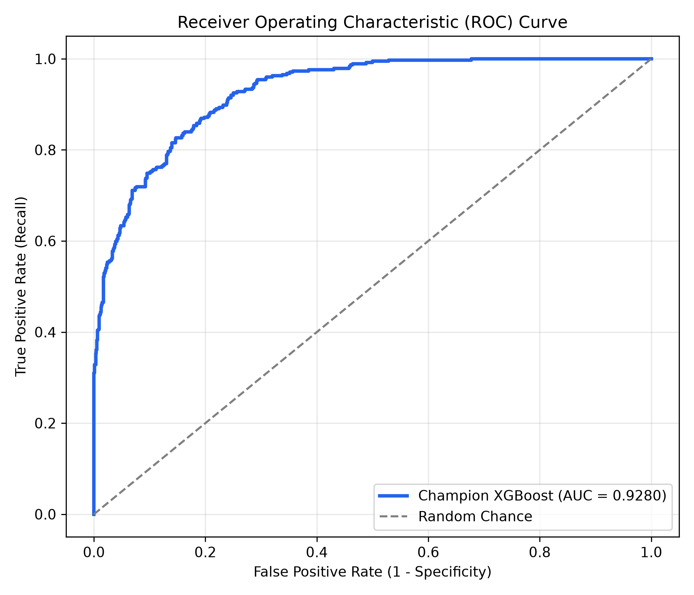
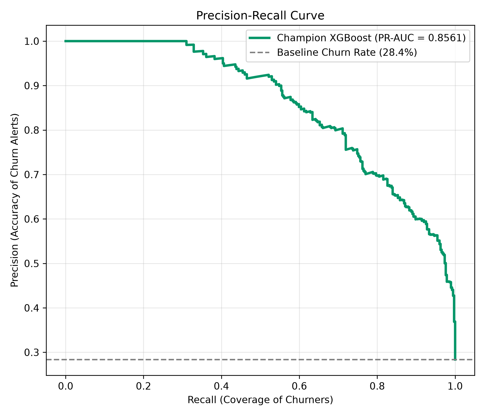
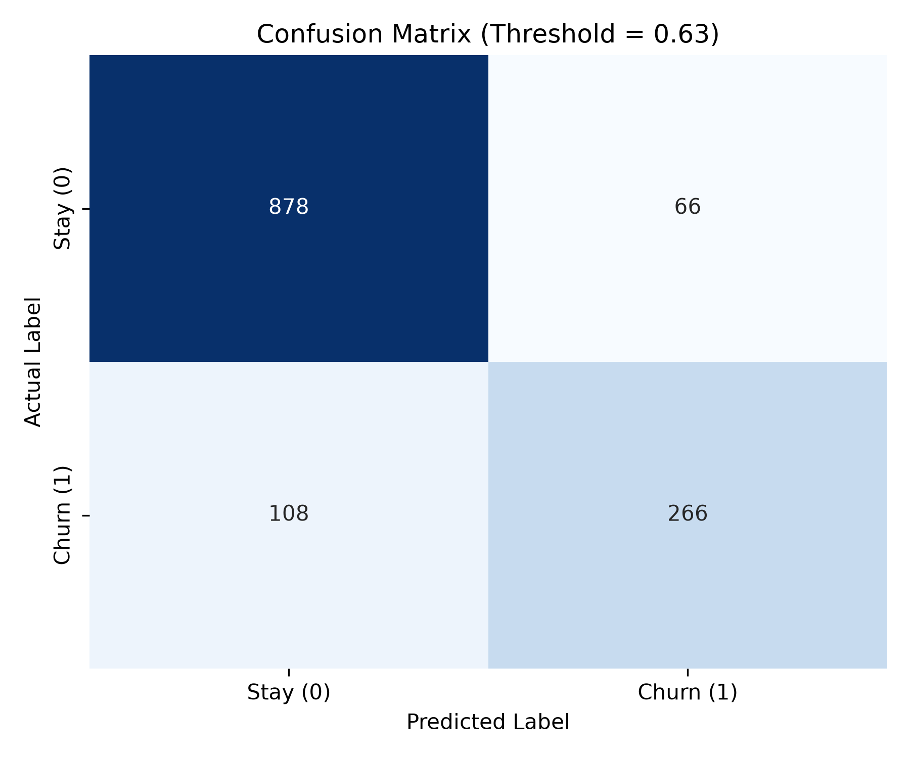
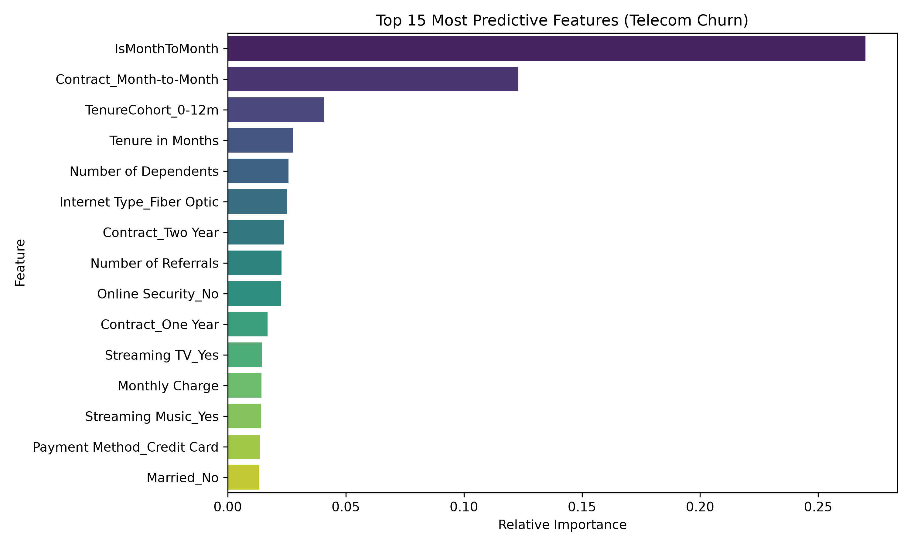

# Telecom Customer Churn Prediction & Retention Discount Engine

[](https://www.python.org/downloads/)
[](https://github.com/astral-sh/uv)
[](https://xgboost.readthedocs.io/)
[](https://www.nvidia.com/)

An end-to-end Machine Learning and Business Decisioning system built for telecommunications providers. The system identifies customers at risk of churning, evaluates their account value and active package subscriptions, and prescribes personalized, margin-preserving retention discounts and promotional offer migrations.

The primary pipeline uses the **Maven Analytics Telecom Customer Churn Dataset**, achieving a **0.9280 Test ROC-AUC** and **0.8561 PR-AUC** with CUDA acceleration on an NVIDIA GPU.

---

## Key Features

- **Package Management via `uv`**: Fast virtual environment management, reproducible locking, and dependency resolution.
- **CUDA GPU Acceleration**: Trained with hardware acceleration on NVIDIA GPUs using XGBoost CUDA histogram building (`tree_method='hist'`, `device='cuda'`).
- **State-of-the-Art Churn Detection**: Achieves **0.9280 Test ROC-AUC** and **0.7535 F1-Score**.
- **Promotional Offer & Package Decision Engine**: Maps churn predictions to targeted marketing offers (`Offer A` through `Offer E`), contract lock-ins, and bill shock remedies.
- **Interactive Rich CLI**: Clean, formatted terminal output with individual customer scoring, batch campaign exports, and visual reports.

---

## Dataset Analysis & Selection

Four datasets were profiled and evaluated in `churn_datasets`:

| Dataset | Shape | Domain Specificity | Promotional Offers Tracked | Test ROC-AUC | Status |
| :--- | :--- | :--- | :--- | :--- | :--- |
| **Maven Telecom Churn** (`telecom_customer_churn.csv`) | **6,589 × 30** | **Broadband & Cellular** | **Yes (`Offer A` to `Offer E`)** | **0.9280** | **Primary Champion** |
| **IBM Telco Customer Churn** (`Telco_customer_churn.xlsx`) | 7,043 × 33 | Telecom & Broadband | No marketing offers | 0.8526 | Evaluated |
| **Telecom_data** (`Client.csv` + `Record.csv`) | 100,000 × 100 | Wireless Mobile Carrier | High telemetry, no packages | 0.6952 | Evaluated |
| **Generic Subscription** (`customer_churn_dataset.csv`) | 440,833 × 12 | Generic SaaS App | Basic high-level tiers | N/A | Excluded |

### Why Maven Telecom Churn is the Champion:
1. **Direct Visibility into Marketing Offers**: Tracks historical marketing offers and their real-world churn rates:
   - **Offer A**: **6.7% churn rate** (Gold standard VIP package)
   - **Offer B**: **12.3% churn rate** (Standard annual saver)
   - **Offer C**: **22.9% churn rate** (Rate lock guarantee)
   - **Offer D**: **26.7% churn rate** (Loyalty courtesy plan)
   - **Offer E**: **67.6% churn rate** (Defective high-churn offer requiring urgent intervention)
2. **Bill Shock Prevention**: `Total Extra Data Charges` identifies customers suffering from unexpected data fees. The retention engine automatically prescribes an Unlimited Data upgrade and waives fees.
3. **Data Consumption Telemetry**: `Avg Monthly GB Download` identifies heavy downloaders needing speed upgrades vs light users needing cost optimization.

---

## Model Benchmarking & Performance

Evaluated across Stratified 5-Fold Cross-Validation on the training split and tested on a held-out 20% test split:

| Model | 5-Fold CV ROC-AUC | Test ROC-AUC | Test PR-AUC | Test Recall | Test F1-Score | Compute Engine |
| :--- | :--- | :--- | :--- | :--- | :--- | :--- |
| **XGBoost Classifier** | **0.9385 (±0.0064)** | **0.9280** | **0.8561** | **0.7647** | **0.7352** | **NVIDIA GPU (CUDA)** |
| **LightGBM** | 0.9395 (±0.0059) | 0.9278 | 0.8560 | 0.7941 | 0.7453 | CPU |
| **Random Forest** | 0.9276 (±0.0086) | 0.9233 | 0.8497 | 0.7995 | 0.7456 | CPU |
| **Logistic Regression** | 0.9164 (±0.0106) | 0.9087 | 0.8057 | 0.8449 | 0.7182 | CPU |

*Training Time: XGBoost 300-tree model completes full 5-fold cross validation and training in **~10 seconds** on a CUDA-accelerated GPU.*

---

## Visual Evaluation Reports

Evaluation charts generated during model evaluation (`eval_reports/`):

| ROC Curve | Precision-Recall Curve |
| :---: | :---: |
|  |  |

| Confusion Matrix | Feature Importances |
| :---: | :---: |
|  |  |

### Top Churn Predictors Identified:
1. **Contract Type (Month-to-Month)**: Over 39% of decision importance.
2. **Tenure in Months**: Churn risk concentrates heavily in early customer months.
3. **Number of Referrals**: Highly negative correlation with churn (referrals indicate strong customer loyalty).
4. **Current Offer (Offer E)**: Accounts on Offer E churn at 67.6%.
5. **Fiber Optic Without Tech Support**: High monthly bill accounts without dedicated technical support.

---

## Retention Discount Strategy

The retention decision engine translates model predictions into tailored business actions:

```
                  ┌─────────────────────────────────┐
                  │ Predicted Churn Probability     │
                  └────────────────┬────────────────┘
                                   │
                  ┌────────────────┴────────────────┐
                  │                                 │
           P(churn) >= 0.60                  P(churn) < 0.60
                  │                                 │
        ┌─────────┴─────────┐              ┌────────┴────────┐
        │                   │              │                 │
  Rev >= $2,500       Rev < $2,500    P >= 0.35 & M2M   P < 0.35
        │                   │              │                 │
     ▼                   ▼              ▼                 ▼
 ┌──────────────┐    ┌──────────────┐ ┌──────────────┐ ┌──────────────┐
 │   VIP_SAVE   │    │STANDARD_SAVE │ │PROACTIVE_SAVE│ │ NO_DISCOUNT  │
 │ 20% Discount │    │ 15% Discount │ │ 12% Discount │ │  No Discount │
 │ Migrate to A │    │ Migrate to B │ │ Migrate to C │ │   Organically│
 │ Free Support │    │Free Security │ │ Free Bandwdth│ │   Retained   │
 └──────────────┘    └──────────────┘ └──────────────┘ └──────────────┘
```

### Batch Campaign Impact (6,589 Customers):
- **NO_DISCOUNT (Safe / Low Risk)**: 4,104 customers (62.3%) — No margin wasted.
- **VIP_SAVE (High Value & Critical Risk)**: 1,210 customers (18.4%) — 20% discount + Offer A migration.
- **STANDARD_SAVE (Moderate Value Churners)**: 646 customers (9.8%) — 15% discount + Offer B migration.
- **PROACTIVE_SAVE (Month-to-Month Converts)**: 467 customers (7.1%) — 12% discount + Offer C rate guarantee.
- **LOYALTY_COURTESY**: 162 customers (2.5%) — 5% courtesy bill credit.
- **Total Projected Net Saved Revenue**: **+$917,265.70** (at 75% offer acceptance).

---

## Installation & Usage

### Prerequisites
- Python 3.12+
- [uv](https://github.com/astral-sh/uv) (recommended) or pip
- Optional: NVIDIA GPU with CUDA drivers

### 1. Clone & Install Dependencies
```bash
git clone https://github.com/<username>/customer_churn_prediction.git
cd customer_churn_prediction

# Sync dependencies using uv (creates .venv automatically)
uv sync
```

### 2. Train Models (GPU or CPU)
```bash
# Trains models using NVIDIA CUDA GPU acceleration (default if CUDA is detected):
uv run customer-churn-prediction train

# Or force CPU training:
uv run customer-churn-prediction train --cpu
```

### 3. Generate Evaluation Charts & Reports
```bash
uv run customer-churn-prediction evaluate
```

### 4. Score an Individual Customer
```bash
uv run customer-churn-prediction recommend --customer-id 0004-TLHLJ
```

Example Output:
```text
╭───────────────────────────────────────────────────────╮
│ Retention & Discount Profile for Customer: 0004-TLHLJ │
╰───────────────────────────────────────────────────────╯
┌──────────────────────────────┬───────────────────────────────────────────────┐
│ Churn Probability            │ 89.3%                                         │
│ Risk Level / Urgency         │ High (High)                                   │
│ Current Marketing Offer      │ Offer E                                       │
│ Total Customer Revenue       │ $415.45                                       │
│ Current Monthly Bill         │ $73.90                                        │
│ Retention Tier               │ STANDARD_SAVE                                 │
│ Recommended Action           │ Standard Retention Plan (Migrate to Offer B)  │
│ Prescribed Target Offer      │ Offer B (Standard Annual Saver)               │
│ Target Discount %            │ 15%                                           │
│ New Discounted Monthly Bill  │ $62.82 (Save $11.08/mo)                       │
│ Contract Requirement         │ 1-Year Contract Commitment                    │
│ Package Add-on Offer         │ Free Online Security upgrade (6m) + Unlimited │
│                              │ Data trial                                    │
│ Expected Saved Revenue (12m) │ $594.09                                       │
│ Discount Cost (12m)          │ $133.02                                       │
│ Net Financial Gain           │ $461.07                                       │
│ Projected ROI %              │ 346.6%                                        │
└──────────────────────────────┴───────────────────────────────────────────────┘

Strategic Telecom Diagnostics & Offer Rationale:
 • URGENT: Customer is on Offer E (67.6% historical churn rate). Immediate migration to Offer A or B required.
 • Fiber Optic account without Premium Tech Support. High risk of switching providers over support friction.
```

### 5. Export Batch Retention Campaign to CSV
```bash
uv run customer-churn-prediction batch-recommend --output retention_campaign_targets.csv
```

---

## Project Structure

```
customer_churn_prediction/
├── README.md                      # Comprehensive project documentation
├── pyproject.toml                 # Project metadata, CLI entry point & dependencies
├── uv.lock                        # Deterministic dependency lockfile
├── .python-version                # Python 3.12 pin for uv
├── .gitignore                     # Git exclusion rules
├── churn_datasets/                # Candidate datasets (Maven Telecom, IBM Telco, Cell2Cell)
│   ├── Maven_telecom/             # Champion dataset (telecom_customer_churn.csv)
│   ├── Telco_customer_churn.xlsx/
│   └── Telecom_data/
├── eval_reports/                  # Generated evaluation visualizations & JSON metrics
│   ├── roc_curve.png
│   ├── precision_recall_curve.png
│   ├── confusion_matrix.png
│   ├── feature_importance.png
│   ├── probability_distribution.png
│   ├── model_benchmark.json
│   └── test_predictions.csv
├── models/                        # Serialized champion model artifacts
│   └── best_churn_model.joblib
├── retention_campaign_targets.csv # Generated batch discount campaign
└── src/
    └── customer_churn_prediction/
        ├── __init__.py            # CLI entry point
        ├── cli.py                 # Rich interactive terminal interface
        ├── config.py              # Constants, feature definitions & discount rules
        ├── data_loader.py         # Dataset loading, cleaning & validation
        ├── discount_engine.py     # Retention decisioning & ROI engine
        ├── evaluate.py            # Evaluation metrics & visualization plotting
        ├── feature_engineering.py # Telecom domain feature transformers
        ├── model_trainer.py       # Cross-validation benchmark & GPU training
        └── train_telecom_data.py  # 100k Cell2Cell GPU training pipeline
```

---

## License

MIT License.
