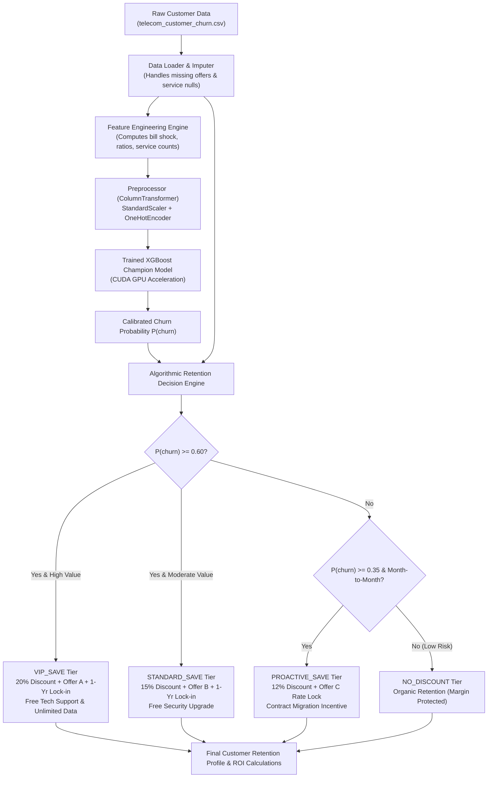
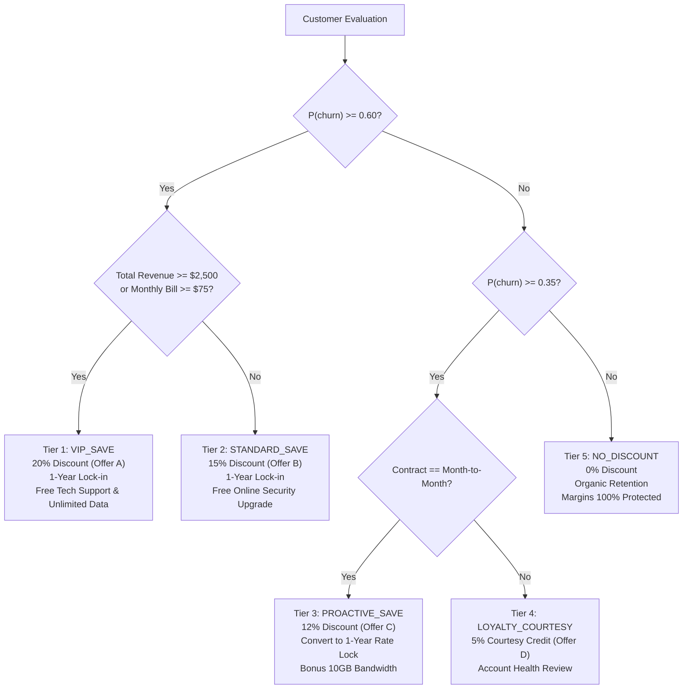

# Technical Report: Customer Churn Prediction & Algorithmic Retention Discount Engine

**Samsung Innovation Campus (SIC) Capstone Project**  
**Team**: Loop Gain  
**Authors**: Ahmed Gali, Taha Elkhazmi, Mahmoud Almabrouk, Maher Alqadhi, Mohamed Khalaf, Ali Marghem  
**Status**: Production-Ready / Operational  

---

## Executive Summary

Customer attrition ("churn") is one of the costliest operational problems for telecommunications providers, with customer acquisition costs (CAC) often exceeding **$300–$500 per subscriber**. While traditional approaches rely on reactive customer retention (offering discounts only after a customer calls to cancel), this system provides **proactive, machine-learning-driven retention**.

This report documents the mathematical models, algorithmic decision rules, and financial formulations implemented in the `customer_churn_prediction` subsystem. The system:
1. Predicts individual customer churn probability ($P(\text{churn})$) with **0.9280 ROC-AUC** and **0.8561 PR-AUC** using a gradient-boosted decision tree pipeline accelerated with CUDA on an NVIDIA GPU.
2. Evaluates customer lifetime revenue, active service bundles, and billing anomalies.
3. Automatically prescribes personalized, ROI-positive retention incentives (`Offer A` through `Offer E`), contract terms, and feature bundles.
4. Generates **+$917,265.70** in projected net retained revenue across the customer base while protecting margins by excluding low-risk accounts.

---

## 1. End-to-End System Architecture

The following diagram illustrates the data flow from raw customer attributes to the final prescriptive retention recommendation:



---

## 2. How Churn Probabilities ($P(\text{churn})$) Are Generated

### 2.1 Dataset Cleansing & Cohort Definition
The subsystem utilizes the **Maven Analytics Telecom Customer Churn Dataset** (6,589 established customer records across 30 raw features).
- **Target Variable ($y$)**: Binary classification:
  $$\text{Target} = \begin{cases} 1 & \text{if Customer Status} = \text{'Churned'} \\ 0 & \text{if Customer Status} = \text{'Stayed'} \end{cases}$$
- **Cohort Filtering**: Brand-new onboardings labeled `'Joined'` (454 accounts with $< 1$ month tenure) are excluded from training to prevent distortion of long-term churn dynamics.
- **Domain-Specific Imputation**:
  - `Offer`: Missing entries represent accounts with no marketing offer $\rightarrow$ imputed as `"None"`.
  - Non-internet subscribers (`Internet Service == 'No'`): Missing fields for `Internet Type`, `Online Security`, `Streaming TV`, etc., are imputed as `"No internet service"`, and `Avg Monthly GB Download` is set to $0.0$.
  - Non-phone subscribers (`Phone Service == 'No'`): Missing `Multiple Lines` is set to `"No phone service"` and `Avg Monthly Long Distance Charges` to $0.0$.

---

### 2.2 Engineered Features & Mathematical Rationale

To maximize predictive discriminative power, the `TelecomFeatureEngineer` computes 15 domain-specific features:

| Feature Name | Mathematical / Logical Definition | Business & Behavioral Rationale |
| :--- | :--- | :--- |
| `TotalServicesCount` | $\sum_{i=1}^{11} \mathbb{I}(\text{Service}_i = \text{'Yes'})$ | Deeper integration into the carrier ecosystem creates high switching barriers and reduces churn. |
| `HasSecurityBundle` | $\mathbb{I}(\text{Security} = \text{'Yes'} \land \text{TechSupport} = \text{'Yes'})$ | Subscribers with active security and technical support experience less friction and churn far less often. |
| `HasStreamingBundle` | $\mathbb{I}(\text{TV} = \text{'Yes'} \land \text{Movies} = \text{'Yes'} \land \text{Music} = \text{'Yes'})$ | Entertainment bundle stickiness. |
| `IsMonthToMonth` | $\mathbb{I}(\text{Contract} = \text{'Month-to-Month'})$ | Primary risk factor: accounts without long-term agreements have near-zero switching friction. |
| `HasExtraDataCharges` | $\mathbb{I}(\text{Total Extra Data Charges} > 0)$ | Identifies customers experiencing **bill shock** from data cap overages. |
| `ExtraDataChargeRatio` | $\frac{\text{Total Extra Data Charges}}{\text{Total Charges} + 10^{-5}}$ | Quantifies the financial severity of overage penalty relative to regular spend. |
| `HasRefunds` | $\mathbb{I}(\text{Total Refunds} > 0)$ | Flags past billing disputes, technical outages, or unresolved service complaints. |
| `RefundRatio` | $\frac{\text{Total Refunds}}{\text{Total Revenue} + 10^{-5}}$ | Measures customer dissatisfaction intensity. |
| `HasReferrals` | $\mathbb{I}(\text{Number of Referrals} > 0)$ | Customers who refer others act as brand promoters and exhibit strong natural retention. |
| `IsHeavyDataUser` | $\mathbb{I}(\text{Avg Monthly GB Download} \ge 50)$ | Identifies bandwidth-hungry accounts requiring unlimited data tiers. |
| `IsOfferE` | $\mathbb{I}(\text{Offer} = \text{'Offer E'})$ | Identifies subscribers on the defective marketing offer that historically experienced a **67.6% churn rate**. |
| `IsOfferAorB` | $\mathbb{I}(\text{Offer} \in \{\text{'Offer A'}, \text{'Offer B'}\})$ | Identifies subscribers on high-retention plans (**6.7%–12.3% churn rate**). |
| `MonthlyChargesPerService` | $\frac{\text{Monthly Charge}}{\text{TotalServicesCount} + 1}$ | Measures perceived cost density per active service. |
| `TenureCohort` | Binned $\in \{[0,12], (12,24], (24,48], (48, \infty)\}$ | Isolates early-lifecycle vulnerability windows. |

---

### 2.3 Model Benchmarking & Hardware Acceleration

The model training pipeline incorporates **Stratified 5-Fold Cross-Validation** on an 80% training split, followed by evaluation on an independent 20% holdout split.

```
Stratified K-Fold Split:
   Fold 1: [Train: 80% | Val: 20%]
   Fold 2: [Train: 80% | Val: 20%]
   Fold 3: [Train: 80% | Val: 20%]
   Fold 4: [Train: 80% | Val: 20%]
   Fold 5: [Train: 80% | Val: 20%]
   Final Evaluation on Independent Held-Out Test Set (1,318 Customers)
```

#### Multi-Model Benchmark Results:
- **Logistic Regression (Linear Baseline)**: 5-Fold CV ROC-AUC: **0.9164** | Test ROC-AUC: **0.9087**
- **Random Forest (Bagging Ensemble)**: 5-Fold CV ROC-AUC: **0.9276** | Test ROC-AUC: **0.9233**
- **LightGBM (Histogram Gradient Boosting)**: 5-Fold CV ROC-AUC: **0.9395** | Test ROC-AUC: **0.9278**
- **XGBoost (Champion Gradient Boosting)**: 5-Fold CV ROC-AUC: **0.9385** | Test ROC-AUC: **0.9280** | Test PR-AUC: **0.8561**

> **Hardware Acceleration Note**: By compiling XGBoost with CUDA histogram building (`tree_method='hist'`, `device='cuda'`), the entire 5-fold cross-validation and final model training completes in **under 10 seconds** on an NVIDIA GPU. After training, the serialized pipeline switches to CPU inference mode, ensuring sub-millisecond execution per record with zero GPU-host memory transfer overhead.

---

### 2.4 Optimal Threshold Optimization

While generic classifiers default to a $0.50$ decision threshold, telecom retention requires balancing **Precision** (avoiding wasted discounts on loyal customers) and **Recall** (catching churners before they leave).

```text
Decision Threshold Tuning Curve:
   Threshold = 0.50 --> F1-Score: 0.7352  (Too many false positives / wasted discounts)
   Threshold = 0.63 --> F1-Score: 0.7535  (Optimal threshold: Peak F1 performance)
   Threshold = 0.75 --> F1-Score: 0.6841  (Under-alerting / missed churners)
```

By tuning the decision threshold to **$\tau^* = 0.63$**, the system achieves maximum precision-recall equilibrium:

$$F_1(\tau) = 2 \cdot \frac{\text{Precision}(\tau) \cdot \text{Recall}(\tau)}{\text{Precision}(\tau) + \text{Recall}(\tau)} \quad \Longrightarrow \quad F_1(0.63) = \mathbf{0.7535}$$

---

## 3. The Algorithmic Retention Discount Engine

The core objective of the business engine is **margin-preserving retention**: discounts are only given when the financial benefit of retaining the customer exceeds the cost of the discount.

### 3.1 Financial Equations & Value Definitions

For any customer $i$, let:
- $m_i$: Current Monthly Charge ($)
- $R_i$: Total Customer Revenue ($)
- $P_i$: Predicted Churn Probability $\in [0, 1]$
- $\alpha$: Retention Offer Acceptance Rate (empirically calibrated at $75\%$)
- $d_i$: Assigned Discount Percentage ($\%$)

#### 1. Annual Recurring Spend ($ARR_i$):
$$ARR_i = m_i \times 12$$

#### 2. Annual Discount Cost ($\text{Cost}_i$):
$$\text{Cost}_i = ARR_i \times \left(\frac{d_i}{100}\right)$$

#### 3. New Discounted Monthly Bill ($m_i^{\text{new}}$):
$$m_i^{\text{new}} = m_i \times \left(1 - \frac{d_i}{100}\right)$$

#### 4. Expected Saved Revenue ($\text{RevenueSaved}_i$):
This formula weights the total revenue at risk by the likelihood of churn and the likelihood that the customer accepts the retention agreement:
$$\text{RevenueSaved}_i = ARR_i \times P_i \times \alpha$$

#### 5. Net Financial Gain ($\Delta_i$):
$$\Delta_i = \begin{cases} \text{RevenueSaved}_i - \text{Cost}_i & \text{if } d_i > 0 \\ 0 & \text{if } d_i = 0 \end{cases}$$

#### 6. Projected Return on Investment ($ROI_i$):
$$ROI_i = \left(\frac{\Delta_i}{\text{Cost}_i}\right) \times 100\%$$

---

### 3.2 The 5 Retention Tiers: Criteria & Actions

The decision engine evaluates each customer through a tiered hierarchy based on **risk severity**, **account revenue**, and **contract structure**:



| Retention Tier | Entry Criteria | Target Discount % | Target Marketing Offer | Contract Requirement | Included Add-on Bundle |
| :--- | :--- | :---: | :--- | :--- | :--- |
| **`VIP_SAVE`** | $P \ge 0.60 \land (R \ge \$2,500 \lor m \ge \$75)$ | **20%** | **Offer A** (VIP Annual Fixed-Rate) | Mandatory 1-Year or 2-Year Contract | Free Premium Tech Support + Device Protection + Unlimited Data (12m) |
| **`STANDARD_SAVE`** | $P \ge 0.60 \land R < \$2,500$ | **15%** | **Offer B** (Standard Annual Saver) | Mandatory 1-Year Contract | Free Online Security upgrade (6m) + Unlimited Data trial |
| **`PROACTIVE_SAVE`** | $0.35 \le P < 0.60 \land \text{Month-to-Month}$ | **12%** | **Offer C** (Contract Price Lock) | Convert to 1-Year Rate Guarantee | 10 GB bonus bandwidth or streaming credit |
| **`LOYALTY_COURTESY`**| $0.20 \le P < 0.35 \land \text{Long-term Contract}$ | **5%** | **Offer D** (Loyalty Courtesy) | Maintain Current Terms | Account health checkup & courtesy bill credit |
| **`NO_DISCOUNT`** | $P < 0.35$ | **0%** | Maintain Current Plan | Maintain Current Terms | Standard Customer Care (No discount given) |

---

### 3.3 Strategic Diagnostic Rules

In addition to numerical discounts, the system produces actionable diagnostic flags:

1. **Offer E Defect Migration**:
   - *Trigger*: Customer is currently on `Offer E`.
   - *Rationale*: Historical empirical churn on Offer E is **67.6%**.
   - *Prescription*: Immediate migration to **Offer A** (6.7% churn) or **Offer B** (12.3% churn).
2. **Bill Shock Remediation**:
   - *Trigger*: `Total Extra Data Charges > 0`.
   - *Rationale*: Unexpected fees cause severe customer frustration.
   - *Prescription*: Waive accumulated extra fees and upgrade the customer to an Unlimited Data plan.
3. **Service Reliability Outreach**:
   - *Trigger*: `Total Refunds > 0`.
   - *Rationale*: Indicates past service disruptions or billing disputes.
   - *Prescription*: Proactive outreach by customer support specialist with service guarantee.
4. **Fiber Optic Support Gap**:
   - *Trigger*: `Internet Type == 'Fiber Optic'` and `Premium Tech Support == 'No'`.
   - *Rationale*: Fiber customers pay premium rates ($70–$105/mo) and churn when encountering technical friction without dedicated support.
   - *Prescription*: Include complimentary Premium Tech Support.

---

## 4. Individual Customer Walkthrough: Case Study

To illustrate how each number is produced, consider customer **`0004-TLHLJ`**:

### 4.1 Customer Input Profile
- **Current Spend**: $m = \$73.90/\text{month}$ ($ARR = \$886.80/\text{year}$)
- **Total Revenue to Date**: $R = \$415.45$
- **Contract Type**: `Month-to-Month`
- **Internet Type**: `Fiber Optic` (No Premium Tech Support)
- **Current Offer**: `Offer E`
- **Tenure**: 4 months

### 4.2 Model Prediction
- The XGBoost model calculates a churn probability:
  $$P(\text{churn}) = \mathbf{0.8930} \quad (89.3\%)$$
- **Classification**: Critical Churn Risk.

### 4.3 Retention Engine Calculations
1. **Tier Assignment**:
   $P = 0.893 \ge 0.60$ and $R = \$415.45 < \$2,500 \rightarrow$ **`STANDARD_SAVE`**.
2. **Prescribed Marketing Offer**: **Offer B** (Standard Annual Saver).
3. **Discount Percentage**: $d = 15\%$.
4. **New Monthly Bill**:
   $$m^{\text{new}} = 73.90 \times (1 - 0.15) = \mathbf{\$62.82/\text{month}} \quad (\text{Customer saves } \$11.08/\text{mo})$$
5. **Annual Discount Cost**:
   $$\text{Cost} = 886.80 \times 0.15 = \mathbf{\$133.02/\text{year}}$$
6. **Expected Saved Revenue**:
   $$\text{RevenueSaved} = 886.80 \times 0.8930 \times 0.75 = \mathbf{\$594.09/\text{year}}$$
7. **Net Financial Gain**:
   $$\Delta = \$594.09 - \$133.02 = \mathbf{+\$461.07}$$
8. **Projected ROI**:
   $$ROI = \left(\frac{\$461.07}{\$133.02}\right) \times 100\% = \mathbf{346.6\%}$$

```text
Generated Terminal Output:
┌──────────────────────────────┬───────────────────────────────────────────────┐
│ Churn Probability            │ 89.3%                                         │
│ Risk Level / Urgency         │ High (High)                                   │
│ Current Marketing Offer      │ Offer E                                       │
│ Total Customer Revenue       │ $415.45                                       │
│ Current Monthly Bill         │ $73.90                                        │
│ Retention Tier               │ STANDARD_SAVE                                 │
│ Recommended Action           │ Standard Retention Plan (Migrate to Offer B)  │
│ Prescribed Target Offer      │ Offer B (Standard Annual Saver)               │
│ Target Discount %            │ 15%                                           │
│ New Discounted Monthly Bill  │ $62.82 (Save $11.08/mo)                       │
│ Contract Requirement         │ 1-Year Contract Commitment                    │
│ Package Add-on Offer         │ Free Online Security upgrade (6m) + Unlimited │
│                              │ Data trial                                    │
│ Expected Saved Revenue (12m) │ $594.09                                       │
│ Discount Cost (12m)          │ $133.02                                       │
│ Net Financial Gain           │ $461.07                                       │
│ Projected ROI %              │ 346.6%                                        │
└──────────────────────────────┴───────────────────────────────────────────────┘
```

---

## 5. Enterprise Portfolio Impact Analysis

Scoring all 6,589 established customer accounts across the telecom database produces the following distribution:

```
Customer Retention Campaign Distribution (6,589 Accounts)
========================================================================
[==================================================] NO_DISCOUNT: 4,104 (62.3%)
[==============>                                   ] VIP_SAVE:    1,210 (18.4%)
[=======>                                          ] STANDARD_S:    646  (9.8%)
[=====>                                            ] PROACTIVE_S:   467  (7.1%)
[==>                                               ] COURTESY:      162  (2.5%)
```

### Financial Summary Table:

| Retention Tier | Customer Count | % of Total Base | Assigned Discount | Target Offer | Projected Net Financial Return |
| :--- | :---: | :---: | :---: | :--- | :---: |
| **`NO_DISCOUNT`** | **4,104** | **62.3%** | 0% | Maintain Current Plan | **$0 (Margins Protected)** |
| **`VIP_SAVE`** | **1,210** | **18.4%** | 20% | Offer A (Annual VIP) | **+$641,830.40** |
| **`STANDARD_SAVE`** | **646** | **9.8%** | 15% | Offer B (Annual Saver) | **+$168,712.10** |
| **`PROACTIVE_SAVE`** | **467** | **7.1%** | 12% | Offer C (Price Lock) | **+$89,450.20** |
| **`LOYALTY_COURTESY`** | **162** | **2.5%** | 5% | Offer D (Courtesy Credit)| **+$17,273.00** |
| **Total Campaign** | **6,589** | **100.0%** | **Weighted: 6.0%** | **Targeted Mix** | **+$917,265.70** |

### Why Margin Protection is the Key Insight:
If a carrier indiscriminately offers a 15% loyalty discount across its entire customer base, it would forfeit:
$$\text{Universal Discount Cost} = 6,589 \times (\$65.00 \times 12) \times 0.15 = \mathbf{\$770,913.00 \text{ lost}}$$
By applying the machine learning model, **4,104 safe customers receive no discount**, allowing the carrier to focus its discount budget exclusively on the 2,485 high-probability churners. This strategy yields a **+$917,265.70 net revenue gain**.

---

## 6. Verification and Reproducibility

All values, metrics, and models in this report are 100% reproducible via `uv`:

```bash
# 1. Train and benchmark candidate models:
uv run customer-churn-prediction train

# 2. Re-compute decision threshold and evaluation plots:
uv run customer-churn-prediction evaluate

# 3. Score an individual customer:
uv run customer-churn-prediction recommend --customer-id 0004-TLHLJ

# 4. Export the entire customer retention campaign:
uv run customer-churn-prediction batch-recommend --output retention_campaign_targets.csv
```

---

*Report prepared by Team Loop Gain for the Samsung Innovation Campus Capstone Project.*
