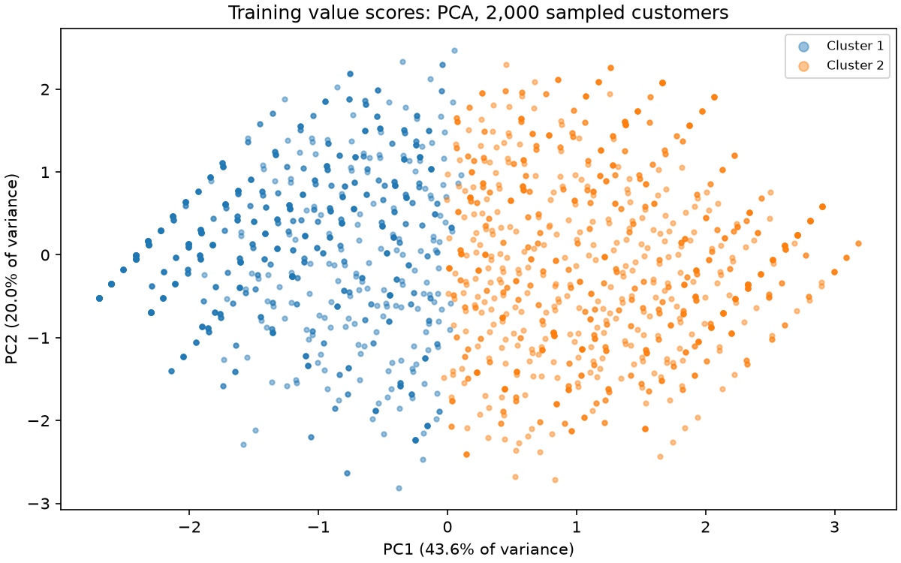
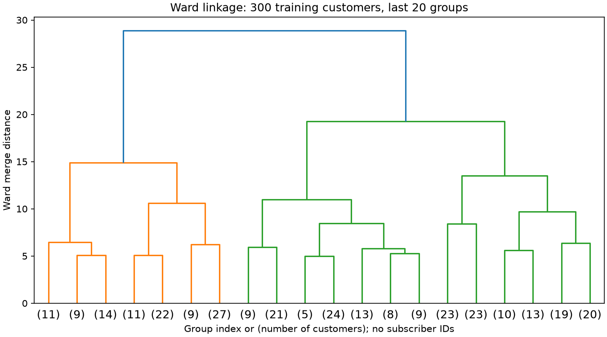

# T10 value tiers

Generated by `uv run churn fit-tiers` from the active training customers in window A.
Validation and test frames, labels and churn model artifacts are not read.
Training customers: 45,858; frozen tier artifact: `tiers-v1-cd15525cb3ef`.
The source behaviour is upGrad prepaid data, not Almadar subscriber behaviour.

## Measures and rules

- Recency: minimum days since airtime or data recharge over the two feature months.
  Without a recharge it is a lower bound censored at the window length.
- Frequency: average monthly airtime plus data recharge counts, a count proxy.
  Separate source counters can overlap; these are not deduplicated transactions.
- Monetary: average monthly airtime plus data recharge amount, using T18's LYD rate.
  The frozen rate is 0.0744643223 LYD per source recharge unit.
  It retains the assumed 40 LYD ARPU anchor; this is not observed operator revenue.
- Tenure: the existing age-on-network snapshot in days, with T4's timing limitation.
- Engagement: how many of voice, data, packs and roaming were used in either month.

Each dimension receives a score from 1 to 5 using training quintile cutoffs.
Recency is negated before ranking so a more recent recharge scores higher.
The equally weighted mean of those scores is cut into five named value tiers.
A value equal to a cutoff belongs to the lower interval; tied customers stay together.
Constant training dimensions receive neutral score 3 even at serving time.
Missing activity blocks follow the input contract; unexpected missing inputs fail.
Tier proportions need not be 20%, and not every tier must be populated.
Cutoffs and the monetary rate travel together in the versioned JSON artifact.
No statistics are fitted on the export being scored.

| Tier | customers | share |
|---|---|---|
| very_low | 9952 | 0.2170 |
| low | 10885 | 0.2374 |
| medium | 7361 | 0.1605 |
| high | 9615 | 0.2097 |
| very_high | 8045 | 0.1754 |

| Measure (recency negated) | 20% | 40% | 60% | 80% |
|---|---|---|---|---|
| recency | -10.0000 | -5.0000 | -2.0000 | -1.0000 |
| frequency | 3.5000 | 5.5000 | 7.5000 | 12.0000 |
| monetary | 8.5634 | 16.6055 | 28.0730 | 50.3379 |
| tenure | 409.0000 | 688.8000 | 1166.0000 | 2280.0000 |
| engagement | 1.0000 | 1.0000 | 2.0000 | 3.0000 |
| composite | 2.0000 | 2.6000 | 3.0000 | 3.6000 |

## Rules compared with clusters

K-Means uses standardized dimension scores fitted on the same training customers.
We search k=2..8 (bounded by distinct score rows), with seed 42 and 10 initializations.
Silhouette uses one fixed sample of 2,000 customers, capped at 2,000, to bound quadratic distance work.
| k | silhouette | inertia |
|---|---|---|
| 2 | 0.2766 | 157014.7489 |
| 3 | 0.2390 | 132856.5957 |
| 4 | 0.2208 | 115504.1221 |
| 5 | 0.2192 | 103357.6187 |
| 6 | 0.2156 | 94333.1858 |
| 7 | 0.2266 | 86115.1148 |
| 8 | 0.2192 | 80919.2182 |

Selected k=2, silhouette=0.2766.
The separation is weak under a descriptive 0.5 heuristic.
The five tiers remain a business reporting convention, not discovered natural segments or evidence of response to retention offers.
Discretization itself can create apparent separation; silhouette is not a release gate.
Adjusted Rand agreement between tier and cluster labels: 0.2702.
Cluster numbers are arbitrary; the table counts customers by tier and cluster.

| Tier / cluster | 1 | 2 |
|---|---|---|
| very_low | 9952 | 0 |
| low | 9259 | 1626 |
| medium | 3314 | 4047 |
| high | 877 | 8738 |
| very_high | 0 | 8045 |

PCA is for visualization only; tier assignment does not use its components.
Ward linkage uses at most 300 randomly sampled training rows.

## 12-month value scenario, not validated CLV

For monthly churn probability p, expected months = sum((1-p)^m, m=1..12).
This assumes a constant hazard, constant monthly spend, no reactivation, no growth, no discounting and no margin adjustment.
The horizon starts at the next month end; p=0 gives 12 months and p=1 gives zero.
We multiply expected months by the two-month average spend in LYD.
The low/base/high scenarios multiply p by 1.5/1/0.5, clipped to [0,1].
These are assumption sensitivities, not confidence bounds, causal savings or profit.
Already-silent customers have no probability and no value estimate.
Without a gated churn bundle, `churn tiers --tiers-only` leaves estimates empty and marks active customers `risk_unavailable`.
The table below uses illustrative hazards, not additional churn predictions or test results.

| Illustrative p | expected months | value at 40 LYD/month |
|---|---|---|
| 0.0 | 12.0000 | 480.0000 |
| 0.05 | 8.7332 | 349.3263 |
| 0.1 | 6.4581 | 258.3254 |
| 0.2 | 3.7251 | 149.0049 |
| 0.5 | 0.9998 | 39.9902 |
| 1.0 | 0.0000 | 0.0000 |

The frozen churn model and the spent test window were not changed or reevaluated.
